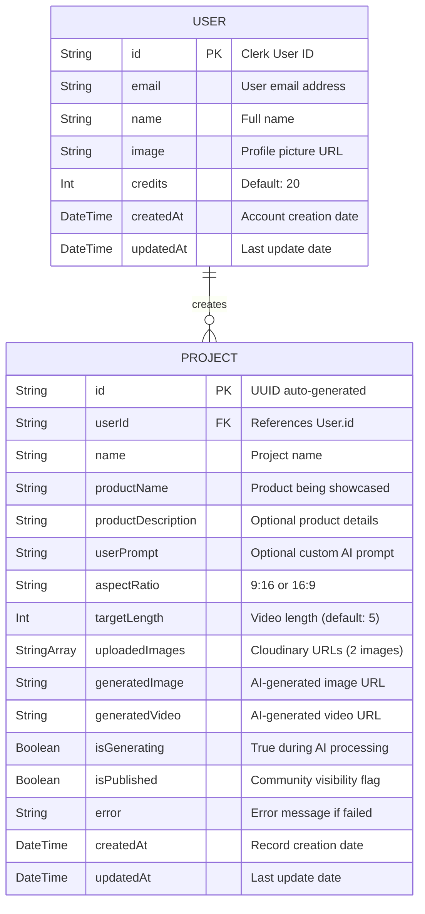

# ER Diagram - UGC Image Generator

## Entity Relationship Diagram

## Relationships

| Relationship | Type | Description |
|---|---|---|
| User -> Project | One-to-Many | One user can create many projects |
| Project -> User | Many-to-One | Each project belongs to exactly one user |

## Constraints

- **Primary Keys**: `User.id` (Clerk ID), `Project.id` (UUID)
- **Foreign Key**: `Project.userId` references `User.id`
- **Cascade Delete**: Deleting a User removes all their Projects
- **Defaults**: `credits = 20`, `aspectRatio = "9:16"`, `isGenerating = false`, `isPublished = false`
