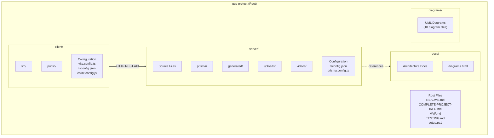
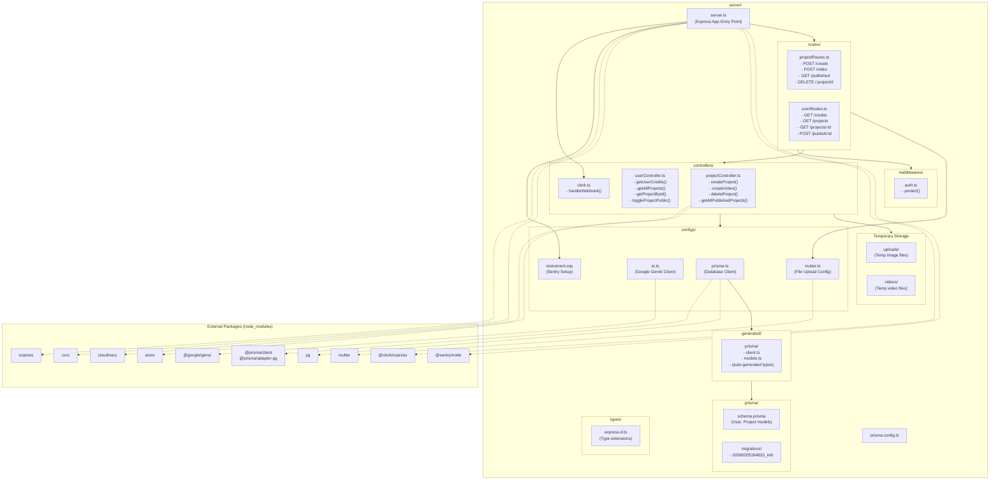

# Package Diagrams - UGC Image Generator

## 1. Overall System Package Diagram

## 2. Client Package Diagram (Detailed)

```mermaid
graph TB
    subgraph ClientPackage["client/src/"]
        subgraph PagesPkg["pages/"]
            Home["Home.tsx"]
            Generator["Genetator.tsx"]
            Result["Result.tsx"]
            MyGenerations["MyGenerations.tsx"]
            Community["Community.tsx"]
            Plans["Plans.tsx"]
            Loading["Loading.tsx"]
        end

        subgraph ComponentsPkg["components/"]
            subgraph LayoutComponents["Layout"]
                Navbar["Navbar.tsx"]
                Footer["Footer.tsx"]
            end
            subgraph UIComponents["UI Components"]
                UploadZone["UploadZone.tsx"]
                ProjectCard["ProjectCard.tsx"]
                Buttons["Buttons.tsx"]
                Title["Title.tsx"]
                SoftBackdrop["SoftBackdrop.tsx"]
            end
            subgraph MarketingComponents["Marketing Sections"]
                Hero["Hero.tsx"]
                Features["Features.tsx"]
                Pricing["Pricing.tsx"]
                Faq["Faq.tsx"]
                CTA["CTA.tsx"]
            end
            subgraph UtilComponents["Utility"]
                Lenis["lenis.tsx"]
            end
        end

        subgraph ConfigsPkg["configs/"]
            AxiosConfig["axios.ts<br/>(HTTP Client Instance)"]
        end

        subgraph TypesPkg["types/"]
            TypeDefs["index.ts<br/>(User, Project, UploadZoneProps)"]
        end

        subgraph AssetsPkg["assets/"]
            AssetsFile["assets.tsx<br/>(Static images, logos)"]
            DummyData["dummy-data.tsx<br/>(Mock data)"]
            SchemaRef["schema.prisma<br/>(Reference copy)"]
        end

        EntryPoint["main.tsx<br/>(React Entry Point)"]
        AppFile["App.tsx<br/>(Route Definitions)"]
        Styles["index.css<br/>(Global Styles)"]
    end

    %% Dependencies
    EntryPoint --> AppFile
    AppFile --> PagesPkg
    PagesPkg --> ComponentsPkg
    PagesPkg --> ConfigsPkg
    PagesPkg --> TypesPkg
    ComponentsPkg --> AssetsPkg
    ComponentsPkg --> TypesPkg

    Home --> Hero
    Home --> Features
    Home --> Pricing
    Home --> Faq
    Home --> CTA
    Generator --> UploadZone
    MyGenerations --> ProjectCard
    Community --> ProjectCard

    %% External Dependencies
    subgraph ExternalPkgs["External Packages (node_modules)"]
        React["react<br/>react-dom"]
        ReactRouter["react-router-dom"]
        ClerkReact["@clerk/clerk-react"]
        Axios["axios"]
        FramerMotion["framer-motion"]
        HotToast["react-hot-toast"]
        Lucide["lucide-react"]
        LenisLib["lenis"]
    end

    EntryPoint -.-> React
    EntryPoint -.-> ClerkReact
    AppFile -.-> ReactRouter
    ConfigsPkg -.-> Axios
    ComponentsPkg -.-> FramerMotion
    ComponentsPkg -.-> HotToast
    ComponentsPkg -.-> Lucide
    UtilComponents -.-> LenisLib
```

## 3. Server Package Diagram (Detailed)

## Package Dependency Summary

### Client Dependencies
| Package | Purpose | Used By |
|---|---|---|
| react, react-dom | UI framework | All components and pages |
| react-router-dom | Client-side routing | App.tsx, all pages |
| @clerk/clerk-react | Authentication UI | main.tsx, Navbar |
| axios | HTTP requests | configs/axios.ts |
| framer-motion | Animations | Components |
| react-hot-toast | Notifications | Pages |
| lucide-react | Icons | Components |
| lenis | Smooth scrolling | lenis.tsx |

### Server Dependencies
| Package | Purpose | Used By |
|---|---|---|
| express | Web framework | server.ts, routes |
| cors | Cross-origin requests | server.ts |
| @clerk/express | Auth middleware | server.ts, middlewares |
| @prisma/client | Database ORM | configs/prisma.ts |
| @google/genai | AI generation | configs/ai.ts |
| cloudinary | Media storage | projectController.ts |
| multer | File uploads | configs/multer.ts |
| @sentry/node | Error tracking | instrument.mjs |
| pg | PostgreSQL driver | configs/prisma.ts |
| axios | HTTP client | projectController.ts |
