# Use Case Diagram - UGC Image Generator

## Use Case Diagram

```mermaid
graph TB
    subgraph System["UGC Image Generator Platform"]
        UC1["Sign Up / Sign In"]
        UC2["Upload Images<br/>(Person + Product)"]
        UC3["Generate AI Image"]
        UC4["View Generation Result"]
        UC5["Download Generated Image"]
        UC6["Generate Video from Image"]
        UC7["Download Generated Video"]
        UC8["Publish to Community"]
        UC9["Unpublish from Community"]
        UC10["View My Generations"]
        UC11["Delete Project"]
        UC12["Browse Community Feed"]
        UC13["View Pricing Plans"]
        UC14["Check Credit Balance"]
        UC15["Sync User Data"]
        UC16["Process Webhook Events"]
        UC17["Store Media Files"]
        UC18["Track Errors"]
    end

    User(("Authenticated<br/>User"))
    Visitor(("Visitor<br/>(Unauthenticated)"))
    ClerkService(("Clerk<br/>Auth Service"))
    GeminiAI(("Google<br/>Gemini AI"))
    Cloudinary(("Cloudinary<br/>Storage"))
    Sentry(("Sentry<br/>Monitoring"))

    %% Visitor Use Cases
    Visitor --> UC12
    Visitor --> UC13
    Visitor --> UC1

    %% Authenticated User Use Cases
    User --> UC1
    User --> UC2
    User --> UC3
    User --> UC4
    User --> UC5
    User --> UC6
    User --> UC7
    User --> UC8
    User --> UC9
    User --> UC10
    User --> UC11
    User --> UC14

    %% External Actor Relationships
    ClerkService --> UC15
    ClerkService --> UC16
    UC3 --> GeminiAI
    UC6 --> GeminiAI
    UC3 --> Cloudinary
    UC6 --> Cloudinary
    UC17 --> Cloudinary
    UC18 --> Sentry

    %% Include Relationships
    UC2 -.->|"<<include>>"| UC14
    UC3 -.->|"<<include>>"| UC2
    UC6 -.->|"<<include>>"| UC14
    UC4 -.->|"<<extend>>"| UC5
    UC4 -.->|"<<extend>>"| UC8
    UC4 -.->|"<<extend>>"| UC6
```

## Actors

| Actor | Type | Description |
|---|---|---|
| Authenticated User | Primary | Logged-in user who can generate content |
| Visitor | Primary | Unauthenticated user browsing the platform |
| Clerk Auth Service | External | Handles authentication and user sync |
| Google Gemini AI | External | Processes image/video generation |
| Cloudinary | External | Stores uploaded and generated media |
| Sentry | External | Monitors and tracks errors |

## Use Cases Summary

| ID | Use Case | Actor(s) |
|---|---|---|
| UC1 | Sign Up / Sign In | User, Visitor |
| UC2 | Upload Images (Person + Product) | User |
| UC3 | Generate AI Image | User, Gemini AI, Cloudinary |
| UC4 | View Generation Result | User |
| UC5 | Download Generated Image | User |
| UC6 | Generate Video from Image | User, Gemini AI, Cloudinary |
| UC7 | Download Generated Video | User |
| UC8 | Publish to Community | User |
| UC9 | Unpublish from Community | User |
| UC10 | View My Generations | User |
| UC11 | Delete Project | User |
| UC12 | Browse Community Feed | Visitor, User |
| UC13 | View Pricing Plans | Visitor, User |
| UC14 | Check Credit Balance | User |
| UC15 | Sync User Data | Clerk Service |
| UC16 | Process Webhook Events | Clerk Service |
