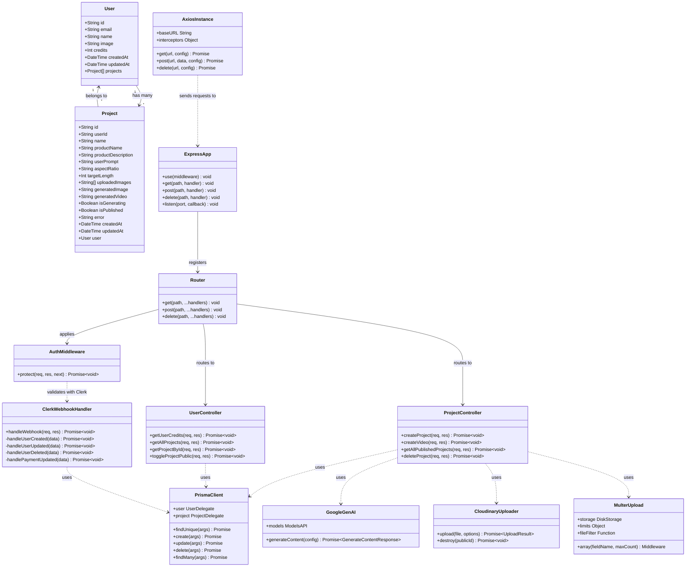

# Class Diagram - UGC Image Generator

## Class Diagram

## Class Descriptions

### Models (Data Layer)
| Class | Description |
|---|---|
| User | Represents a platform user with credits and profile info |
| Project | Represents an AI generation project with images, videos, and metadata |

### Controllers (Business Logic)
| Class | Description |
|---|---|
| ProjectController | Handles image/video generation, publishing, and deletion |
| UserController | Handles user data queries, credit checks, and project retrieval |
| ClerkWebhookHandler | Processes Clerk authentication webhooks for user sync |

### Middleware
| Class | Description |
|---|---|
| AuthMiddleware | Validates JWT tokens and protects routes |

### Services / Configurations
| Class | Description |
|---|---|
| PrismaClient | ORM client for PostgreSQL database operations |
| GoogleGenAI | Google Gemini AI client for image/video generation |
| CloudinaryUploader | Media storage and CDN service |
| MulterUpload | File upload middleware for handling multipart form data |
| AxiosInstance | HTTP client configured with auth interceptors |

### Infrastructure
| Class | Description |
|---|---|
| ExpressApp | Main web server application |
| Router | Express router for API endpoint definitions |
