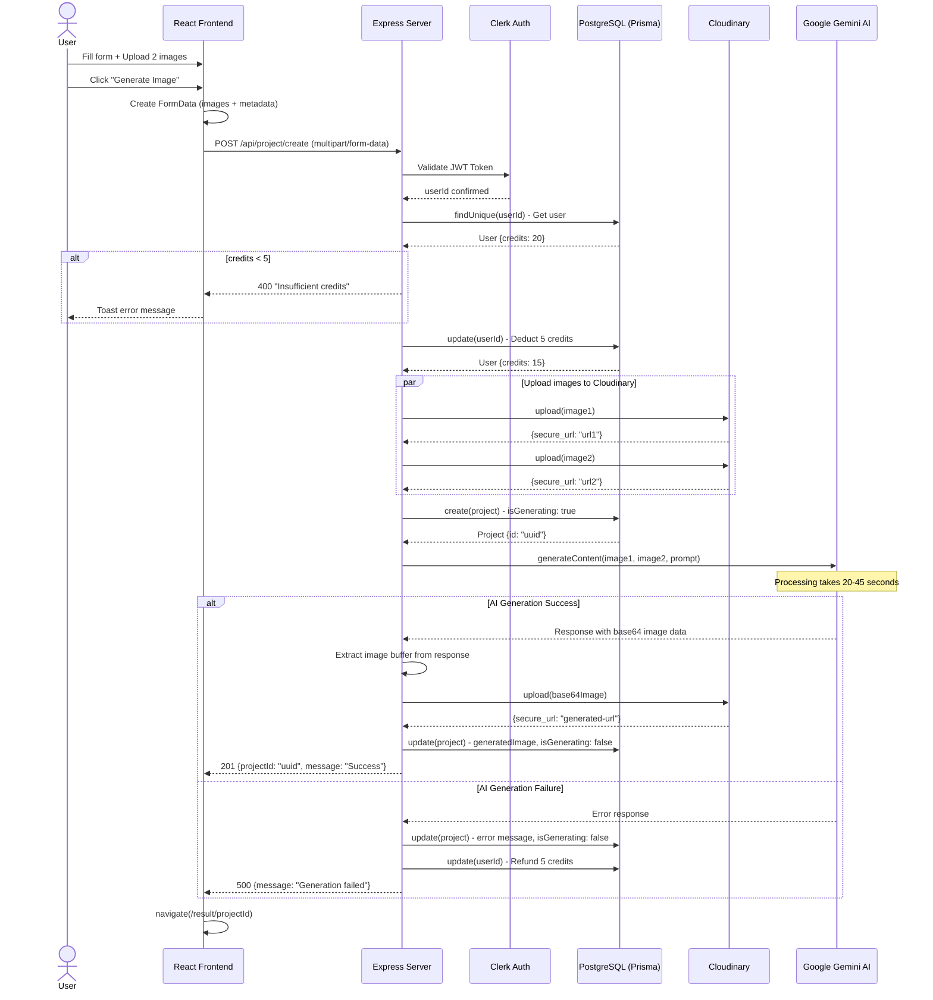
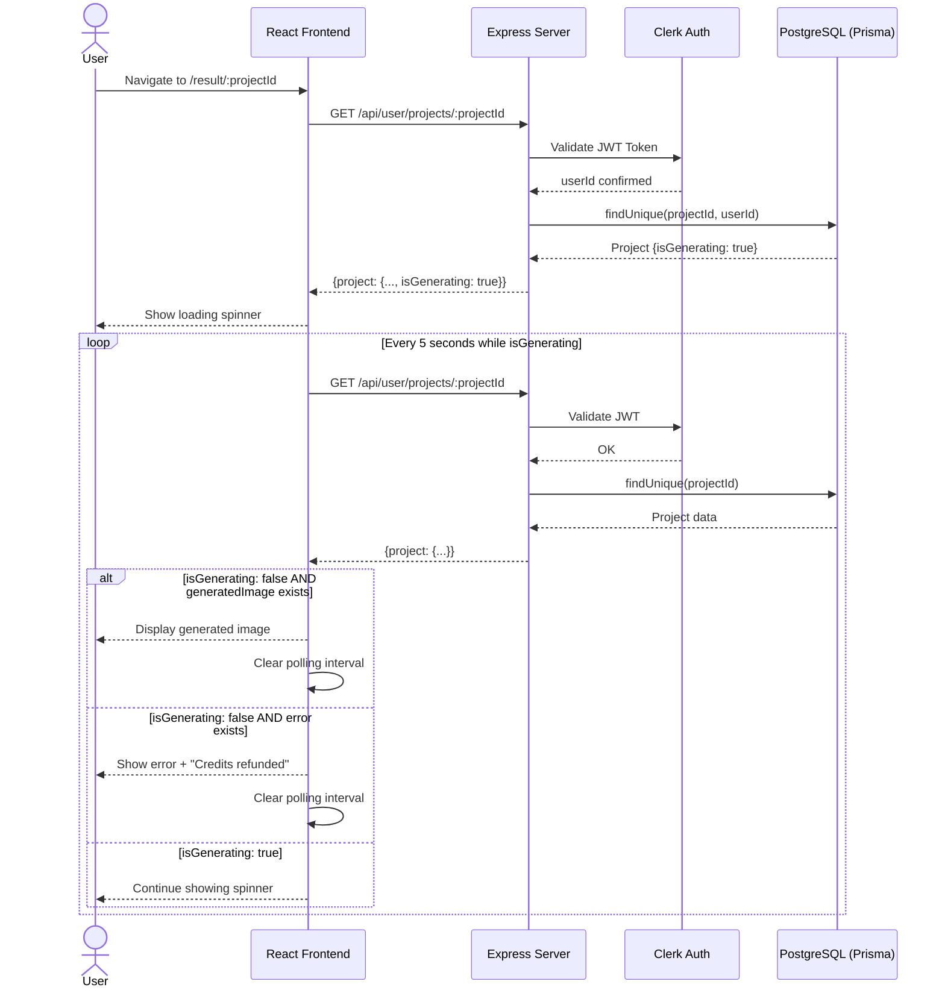
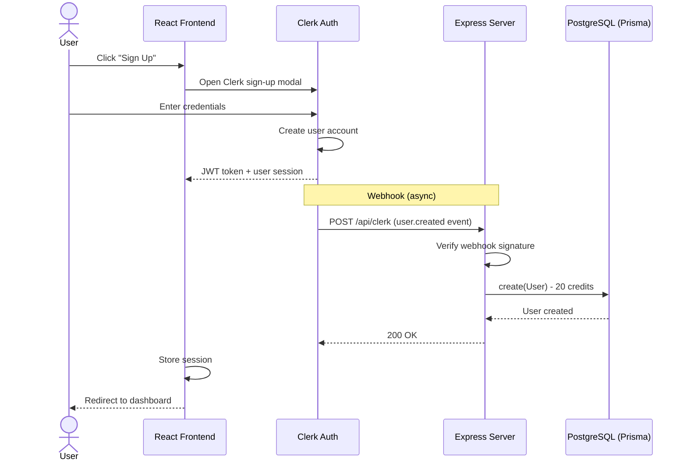
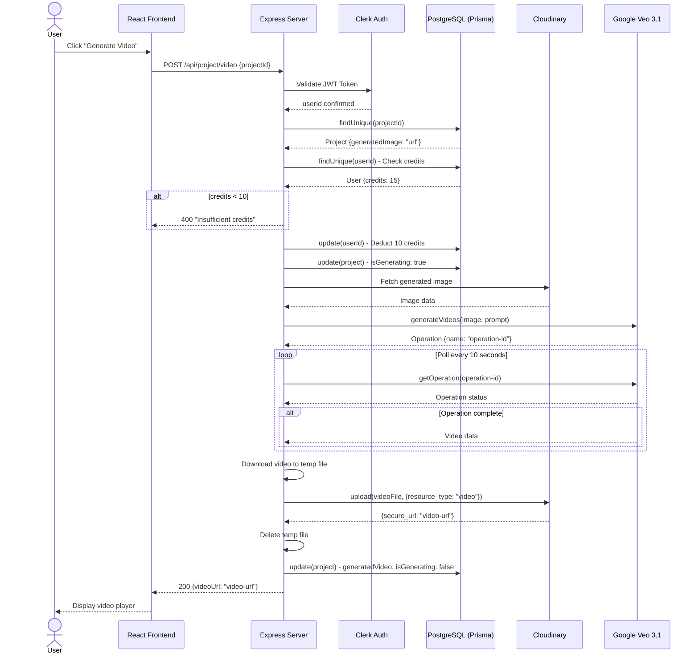
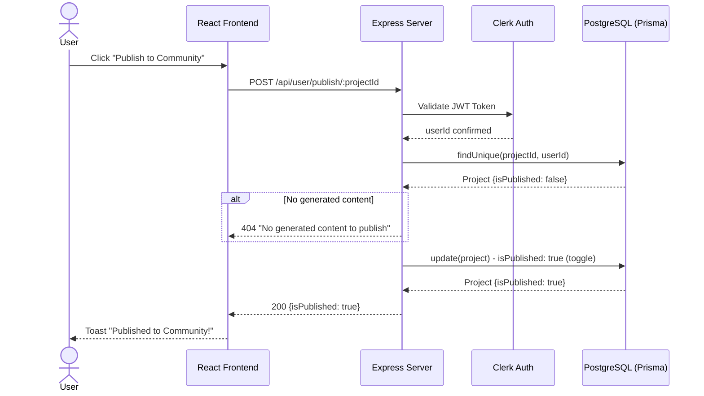

# Sequence Diagrams - UGC Image Generator

## 1. Image Generation Sequence

## 2. Result Page Polling Sequence

## 3. User Authentication Sequence

## 4. Video Generation Sequence

## 5. Publish/Unpublish Sequence

