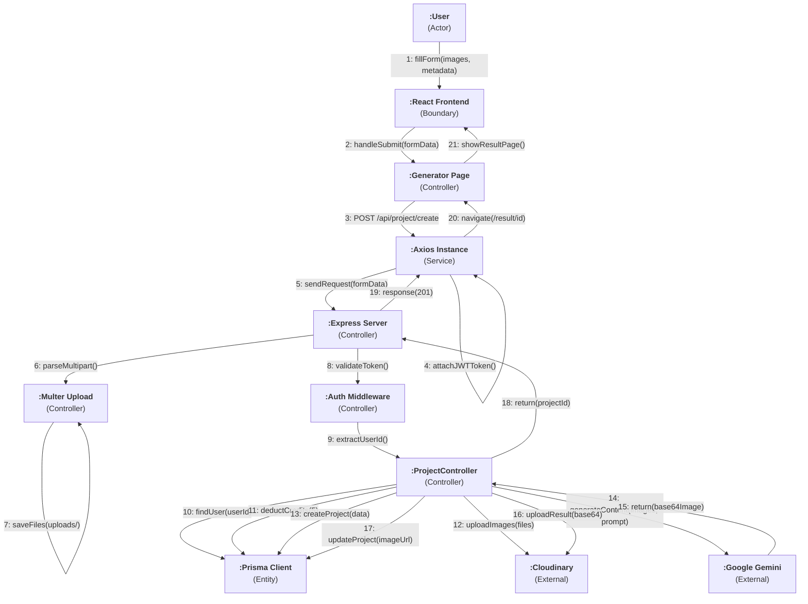
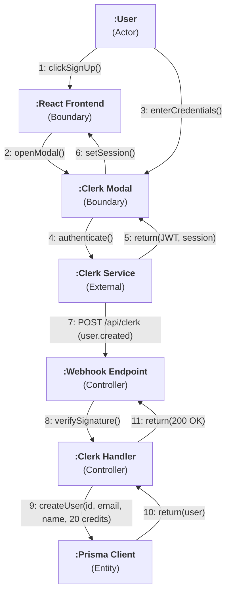
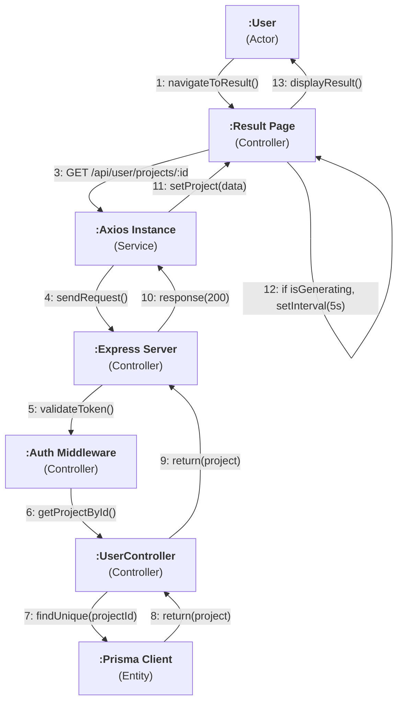

# Collaboration Diagram - UGC Image Generator

## 1. Image Generation Collaboration

## 2. User Authentication Collaboration

## 3. Result Polling Collaboration

## Object Interaction Summary

| Object | Role | Collaborates With |
|---|---|---|
| User (Actor) | Initiates all interactions | Frontend components |
| React Frontend | UI boundary, form handling | Axios, Pages, Components |
| Generator Page | Orchestrates image upload flow | Axios, UploadZone, FormData |
| Result Page | Manages polling and display | Axios, Project state |
| Axios Instance | HTTP communication layer | Express Server (API) |
| Express Server | Request routing and middleware | Auth, Multer, Controllers |
| Auth Middleware | JWT token validation | Clerk service |
| ProjectController | Business logic for generations | Prisma, Cloudinary, Gemini |
| UserController | Business logic for user data | Prisma |
| Clerk Handler | Webhook event processing | Prisma |
| Prisma Client | Database operations | PostgreSQL |
| Cloudinary | Media file storage | File system |
| Google Gemini AI | Image/video generation | API calls |
