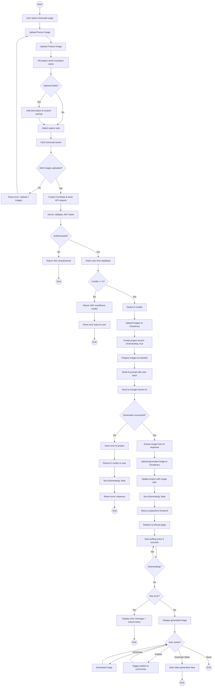
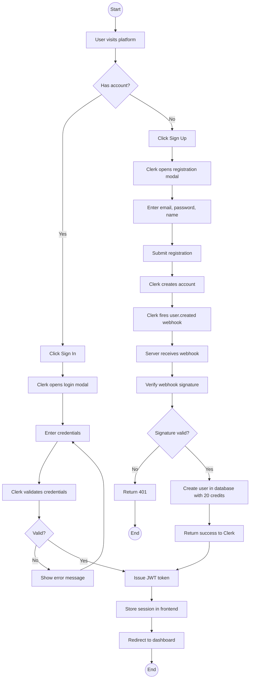
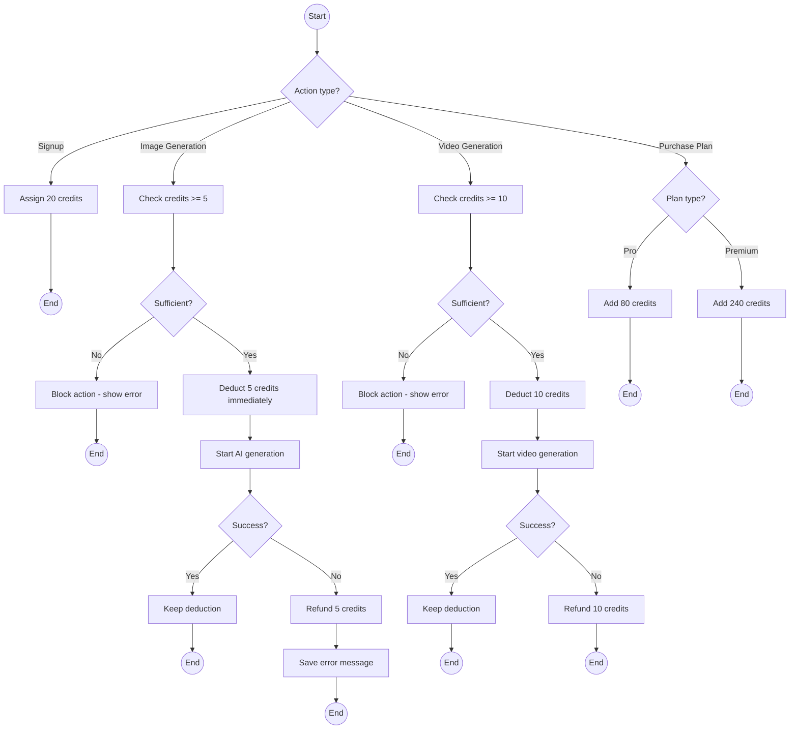
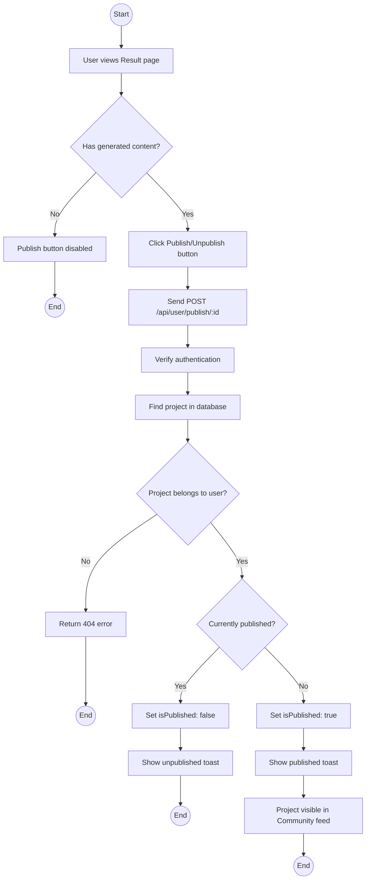

# Activity Diagram - UGC Image Generator

## 1. Image Generation Activity

```mermaid
flowchart TD
    Start((Start)) --> A[User opens Generator page]
    A --> B[Upload Person Image]
    B --> C[Upload Product Image]
    C --> D[Fill project name & product name]
    D --> E{Optional fields?}
    E -->|Yes| F[Add description & custom prompt]
    E -->|No| G[Select aspect ratio]
    F --> G
    G --> H[Click Generate button]
    H --> I{Both images uploaded?}
    I -->|No| J[Show error: Upload 2 images]
    J --> B
    I -->|Yes| K[Create FormData & send API request]
    K --> L[Server validates JWT token]
    L --> M{Authenticated?}
    M -->|No| N[Return 401 Unauthorized]
    N --> End1((End))
    M -->|Yes| O[Fetch user from database]
    O --> P{Credits >= 5?}
    P -->|No| Q[Return 400: Insufficient credits]
    Q --> R[Show error toast to user]
    R --> End2((End))
    P -->|Yes| S[Deduct 5 credits]
    S --> T[Upload images to Cloudinary]
    T --> U[Create project record - isGenerating: true]
    U --> V[Prepare images as base64]
    V --> W[Build AI prompt with user input]
    W --> X[Send to Google Gemini AI]
    X --> Y{Generation successful?}
    Y -->|No| Z[Save error to project]
    Z --> AA[Refund 5 credits to user]
    AA --> AB[Set isGenerating: false]
    AB --> AC[Return error response]
    AC --> End3((End))
    Y -->|Yes| AD[Extract image from AI response]
    AD --> AE[Upload generated image to Cloudinary]
    AE --> AF[Update project with image URL]
    AF --> AG[Set isGenerating: false]
    AG --> AH[Return projectId to frontend]
    AH --> AI[Redirect to Result page]
    AI --> AJ[Start polling every 5 seconds]
    AJ --> AK{isGenerating?}
    AK -->|Yes| AJ
    AK -->|No| AL{Has error?}
    AL -->|Yes| AM[Display error message + refund notice]
    AM --> End4((End))
    AL -->|No| AN[Display generated image]
    AN --> AO{User action?}
    AO -->|Download| AP[Download image]
    AO -->|Publish| AQ[Toggle publish to community]
    AO -->|Generate Video| AR[Start video generation flow]
    AO -->|Done| End5((End))
    AP --> AO
    AQ --> AO
    AR --> End6((End))
```

## 2. User Registration Activity

```mermaid
flowchart TD
    Start((Start)) --> A[User visits platform]
    A --> B{Has account?}
    B -->|Yes| C[Click Sign In]
    B -->|No| D[Click Sign Up]
    D --> E[Clerk opens registration modal]
    E --> F[Enter email, password, name]
    F --> G[Submit registration]
    G --> H[Clerk creates account]
    H --> I[Clerk fires user.created webhook]
    I --> J[Server receives webhook]
    J --> K[Verify webhook signature]
    K --> L{Signature valid?}
    L -->|No| M[Return 401]
    M --> End1((End))
    L -->|Yes| N[Create user in database with 20 credits]
    N --> O[Return success to Clerk]
    C --> P[Clerk opens login modal]
    P --> Q[Enter credentials]
    Q --> R[Clerk validates credentials]
    R --> S{Valid?}
    S -->|No| T[Show error message]
    T --> Q
    S -->|Yes| U[Issue JWT token]
    O --> U
    U --> V[Store session in frontend]
    V --> W[Redirect to dashboard]
    W --> End2((End))
```

## 3. Credit Management Activity

```mermaid
flowchart TD
    Start((Start)) --> A{Action type?}
    A -->|Signup| B[Assign 20 credits]
    B --> End1((End))
    A -->|Image Generation| C[Check credits >= 5]
    C --> D{Sufficient?}
    D -->|No| E[Block action - show error]
    E --> End2((End))
    D -->|Yes| F[Deduct 5 credits immediately]
    F --> G[Start AI generation]
    G --> H{Success?}
    H -->|Yes| I[Keep deduction]
    I --> End3((End))
    H -->|No| J[Refund 5 credits]
    J --> K[Save error message]
    K --> End4((End))
    A -->|Video Generation| L[Check credits >= 10]
    L --> M{Sufficient?}
    M -->|No| N[Block action - show error]
    N --> End5((End))
    M -->|Yes| O[Deduct 10 credits]
    O --> P[Start video generation]
    P --> Q{Success?}
    Q -->|Yes| R[Keep deduction]
    R --> End6((End))
    Q -->|No| S[Refund 10 credits]
    S --> End7((End))
    A -->|Purchase Plan| T{Plan type?}
    T -->|Pro| U[Add 80 credits]
    T -->|Premium| V[Add 240 credits]
    U --> End8((End))
    V --> End9((End))
```

## 4. Community Publishing Activity

```mermaid
flowchart TD
    Start((Start)) --> A[User views Result page]
    A --> B{Has generated content?}
    B -->|No| C[Publish button disabled]
    C --> End1((End))
    B -->|Yes| D[Click Publish/Unpublish button]
    D --> E[Send POST /api/user/publish/:id]
    E --> F[Verify authentication]
    F --> G[Find project in database]
    G --> H{Project belongs to user?}
    H -->|No| I[Return 404 error]
    I --> End2((End))
    H -->|Yes| J{Currently published?}
    J -->|Yes| K[Set isPublished: false]
    K --> L[Show unpublished toast]
    L --> End3((End))
    J -->|No| M[Set isPublished: true]
    M --> N[Show published toast]
    N --> O[Project visible in Community feed]
    O --> End4((End))
```
