# State Chart Diagrams - UGC Image Generator

## 1. Project State Chart

## 2. User Account State Chart

```mermaid
stateDiagram-v2
    [*] --> Visitor: Lands on platform

    Visitor --> Registering: Clicks Sign Up
    Visitor --> LoggingIn: Clicks Sign In
    Visitor --> BrowsingCommunity: Views community feed
    Visitor --> ViewingPlans: Views pricing

    Registering --> Authenticated: Registration successful<br/>(20 credits assigned)
    LoggingIn --> Authenticated: Login successful
    LoggingIn --> Visitor: Login failed

    Authenticated --> Active: Has credits > 0
    Authenticated --> OutOfCredits: Credits = 0

    Active --> Generating: Starts image generation
    Generating --> Active: Generation complete
    Generating --> Active: Generation failed (refund)

    Active --> OutOfCredits: Last credits used
    OutOfCredits --> Active: Purchases credits

    Active --> LoggedOut: Signs out
    OutOfCredits --> LoggedOut: Signs out
    LoggedOut --> Visitor

    Active --> AccountDeleted: Deletes account
    OutOfCredits --> AccountDeleted: Deletes account
    AccountDeleted --> [*]
```

## 3. Image Generation Process State Chart

## 4. Authentication State Chart

## State Summary Table

| Entity | States | Key Transitions |
|---|---|---|
| Project | Created, Generating, Generated, Failed, Published, Unpublished, VideoGenerating, Deleted | Generation start/complete/fail, Publish toggle, Delete |
| User Account | Visitor, Registering, Authenticated, Active, OutOfCredits, LoggedOut | Auth, credit use, credit purchase, logout |
| Generation Process | Idle, FormFilling, Submitting, Validating, Processing, Complete, Failed | Form submit, validation pass/fail, AI success/error |
| Authentication | Unauthenticated, ClerkModal, SessionActive | Login/signup, token refresh, logout |
