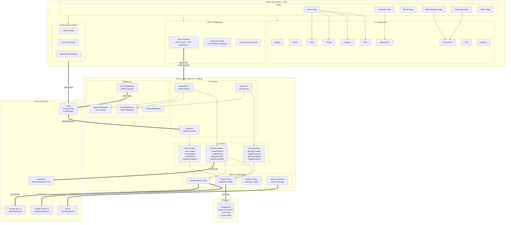

# Component Diagram - UGC Image Generator

## System Component Diagram

## Component Descriptions

### Client Components

| Component | Type | Responsibility |
|---|---|---|
| Home Page | Page | Landing page with marketing sections |
| Generator Page | Page | Image upload form and generation trigger |
| Result Page | Page | Display results with polling mechanism |
| MyGenerations Page | Page | User's project gallery |
| Community Page | Page | Public feed of published projects |
| Plans Page | Page | Credit pricing and purchase info |
| Navbar | UI Component | Navigation, auth buttons, credit display |
| UploadZone | UI Component | Drag-and-drop file upload |
| ProjectCard | UI Component | Project thumbnail with actions |
| Axios Instance | Config | HTTP client with JWT interceptor |
| Clerk Provider | Auth | Authentication context provider |

### Server Components

| Component | Type | Responsibility |
|---|---|---|
| Project Routes | Route | API endpoints for generation operations |
| User Routes | Route | API endpoints for user data queries |
| Webhook Route | Route | Clerk event processing |
| ProjectController | Controller | Image/video generation business logic |
| UserController | Controller | User data and project retrieval |
| Auth Middleware | Middleware | JWT token validation |
| Multer Middleware | Middleware | Multipart file upload handling |
| Prisma Client | Config | Database ORM operations |
| AI Client | Config | Google Gemini/Veo API communication |
| Sentry | Config | Error tracking and monitoring |

### External Services

| Service | Protocol | Purpose |
|---|---|---|
| Clerk | OAuth/JWT/Webhooks | User authentication and management |
| Google Gemini AI | HTTPS REST | AI image generation |
| Google Veo 3.1 | HTTPS REST | AI video generation |
| Cloudinary | HTTPS REST | Media file storage and CDN |
| Sentry | HTTPS | Error monitoring and alerting |
| PostgreSQL (Neon) | TCP/SSL | Relational database |
