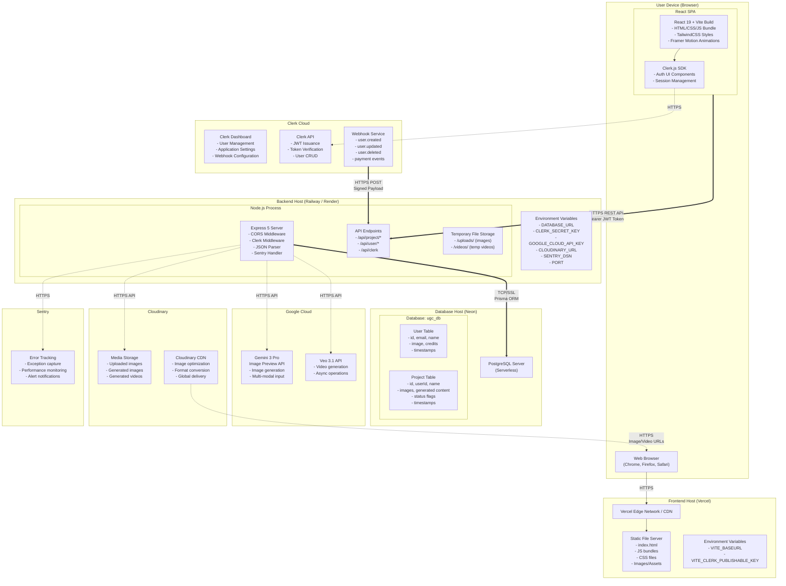

# Deployment Diagram - UGC Image Generator

## Deployment Diagram



## Deployment Nodes Summary

| Node | Platform | Technology | Purpose |
|---|---|---|---|
| User Device | Browser | Chrome/Firefox/Safari | Client-side rendering |
| Frontend Host | Vercel | Static file server + CDN | Serves React SPA |
| Backend Host | Railway/Render | Node.js 18+ runtime | Express API server |
| Database | Neon | PostgreSQL (Serverless) | Data persistence |
| Clerk Cloud | Clerk SaaS | Auth platform | User management & JWT |
| Google Cloud | Google AI | Gemini 3 + Veo 3.1 | AI generation |
| Cloudinary | Cloudinary SaaS | Media platform | File storage & CDN |
| Sentry | Sentry SaaS | Monitoring platform | Error tracking |

## Communication Protocols

| From | To | Protocol | Data Format |
|---|---|---|---|
| Browser | Vercel CDN | HTTPS | HTML/CSS/JS |
| React App | Express API | HTTPS REST | JSON, multipart/form-data |
| Express | PostgreSQL | TCP/SSL | SQL (via Prisma) |
| Express | Gemini AI | HTTPS | JSON (base64 images) |
| Express | Cloudinary | HTTPS | Binary/base64 uploads |
| Clerk | Express Webhook | HTTPS POST | Signed JSON payload |
| Cloudinary CDN | Browser | HTTPS | Image/Video binary |

## Deployment Configuration

### Frontend (Vercel)
```
Build Command: npm run build
Output Directory: dist/
Node Version: 18.x
Environment Variables:
  - VITE_BASEURL = https://api.your-domain.com
  - VITE_CLERK_PUBLISHABLE_KEY = pk_live_xxx
```

### Backend (Railway/Render)
```
Build Command: npm install && npx prisma generate && npm run build
Start Command: npx prisma migrate deploy && npm start
Node Version: 18.x
Port: 5000
Environment Variables:
  - DATABASE_URL
  - CLERK_SECRET_KEY
  - CLERK_PUBLISHABLE_KEY
  - CLERK_WEBHOOK_SIGNING_SECRET
  - GOOGLE_CLOUD_API_KEY
  - CLOUDINARY_URL
  - SENTRY_DSN
```

### Database (Neon)
```
Engine: PostgreSQL 16
Mode: Serverless
SSL: Required
Connection Pooling: Enabled
Auto-suspend: After 5 minutes idle
```
