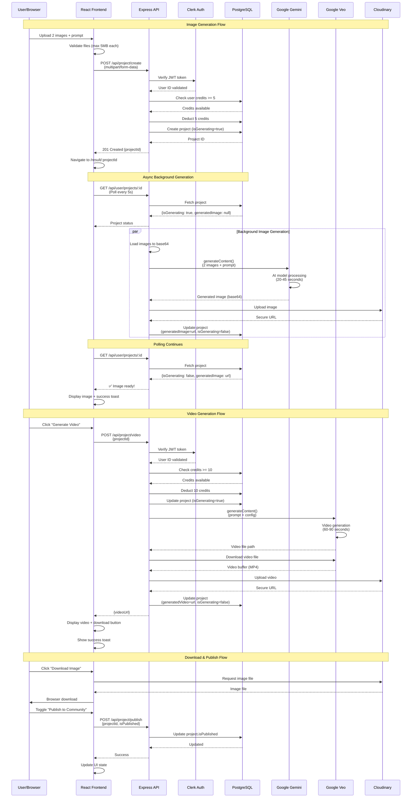

# UGC Image & Video Generator - Data Flow Architecture

This diagram shows the detailed data flow for image and video generation.



## Key Data Flows

### 1. Image Generation (20-45 seconds)
- **Input**: 2 images (person + product) + text prompt
- **Process**: Gemini 3 Pro combines images realistically
- **Output**: Professional ecommerce-quality image
- **Cost**: 5 credits

### 2. Video Generation (60-90 seconds)
- **Input**: Text prompt describing desired video
- **Process**: Google Veo 3.1 creates 720p MP4 video
- **Output**: High-quality video (aspect ratio: 9:16, 16:9, or 1:1)
- **Cost**: 10 credits

### 3. Polling Mechanism
- **Initial**: Checks at 2s, 5s, 8s after navigation
- **Continuous**: Every 5 seconds while `isGenerating=true`
- **Stop Condition**: When `isGenerating=false` or error occurs

### 4. Credit System
- **Initial**: 20 credits on signup
- **Deduction**: Upfront before generation
- **Refund**: If generation fails
- **Tracking**: Real-time updates in user profile

### 5. Error Handling
- Retry failed API calls (3 attempts for 404)
- Refund credits on generation failure
- Display error messages via toast notifications
- Log errors to Sentry for monitoring

## File Storage Structure

```
Cloudinary Storage
├── images/
│   └── {unique-id}.png (generated images)
└── videos/
    └── {unique-id}.mp4 (generated videos)
```

## Database Schema

```
User
- id: UUID (PK)
- clerkId: String (unique)
- email: String
- credits: Int (default: 20)
- createdAt: DateTime
- updatedAt: DateTime
- projects: Project[]

Project
- id: UUID (PK)
- userId: UUID (FK)
- userImage: String (input image 1)
- productImage: String (input image 2)
- userPrompt: String
- generatedImage: String? (Cloudinary URL)
- generatedVideo: String? (Cloudinary URL)
- isPublished: Boolean (default: false)
- isGenerating: Boolean (default: true)
- error: String? (generation error message)
- createdAt: DateTime
- updatedAt: DateTime
- user: User
```
