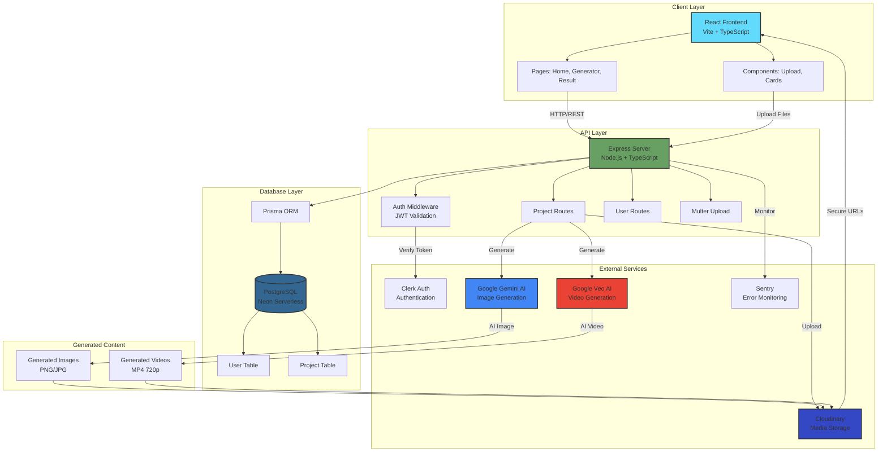

# UGC Image & Video Generator - System Architecture

This diagram shows the overall system architecture and component interactions.

## Component Details

### Frontend (React)
- **Technology**: React 19, TypeScript, Vite, TailwindCSS 4
- **Key Features**: 
  - Image upload with drag & drop
  - Real-time generation status
  - Auto-refresh polling
  - Download & publish functionality

### Backend (Express)
- **Technology**: Node.js, Express 5, TypeScript
- **Key Features**:
  - JWT authentication via Clerk
  - Async image/video generation
  - Credit system (5 per image, 10 per video)
  - File upload handling with Multer

### Database (PostgreSQL + Prisma)
- **Tables**:
  - **User**: clerkId, email, credits, timestamps
  - **Project**: userId, images, prompt, generatedImage, generatedVideo, isPublished, isGenerating

### External Services
- **Clerk**: User authentication & JWT tokens
- **Google Gemini 3 Pro**: AI image generation from 2 input images
- **Google Veo 3.1**: AI video generation from prompts
- **Cloudinary**: Media storage & CDN for images/videos
- **Sentry**: Error tracking & monitoring

## Data Flow Summary
1. User uploads 2 images + prompt through React frontend
2. Backend validates JWT token via Clerk
3. Backend deducts 5 credits and creates project record
4. Background job generates image using Google Gemini AI
5. Generated image uploaded to Cloudinary
6. Frontend polls every 5s until generation completes
7. User can generate video (10 credits) from generated image
8. Video generated using Google Veo AI and uploaded to Cloudinary
