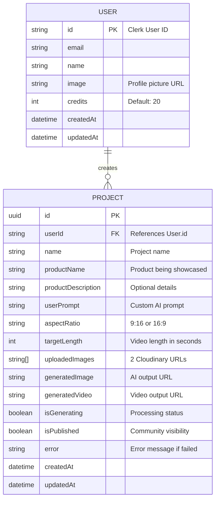

# Entity-Relationship (ER) Diagram

## UGC Image Generator - Database Design

This ER diagram shows the database schema and relationships between entities.



## Relationship Details

### USER to PROJECT (One-to-Many)
- **Cardinality**: One user can have zero or many projects
- **Foreign Key**: `PROJECT.userId` references `USER.id`
- **Cascade Rule**: `ON DELETE CASCADE` - Deleting a user deletes all their projects
- **Business Logic**: 
  - User must exist before creating a project
  - User can view/manage only their own projects
  - Admin can view all projects

## Field Constraints

### USER Table
- `id`: Primary Key, unique, not null (Clerk-provided)
- `email`: Unique, not null
- `name`: Not null
- `image`: URL string
- `credits`: Integer, default 20, must be >= 0
- `createdAt`: Auto-generated timestamp
- `updatedAt`: Auto-updated timestamp

### PROJECT Table
- `id`: UUID Primary Key, auto-generated
- `userId`: Foreign Key, not null, indexed
- `name`: String, not null
- `productName`: String, not null
- `productDescription`: String, default ""
- `userPrompt`: String, default ""
- `aspectRatio`: String, default "9:16"
- `targetLength`: Integer, default 5
- `uploadedImages`: Array of strings (2 URLs)
- `generatedImage`: String, default ""
- `generatedVideo`: String, default ""
- `isGenerating`: Boolean, default false
- `isPublished`: Boolean, default false
- `error`: String, default ""
- `createdAt`: Auto-generated timestamp
- `updatedAt`: Auto-updated timestamp

## Indexes

### USER Table
- Primary Index: `id`
- Unique Index: `email`

### PROJECT Table
- Primary Index: `id`
- Foreign Key Index: `userId`
- Composite Index: `(userId, createdAt)` for efficient user project listing
- Filter Index: `isPublished = true` for community feed queries

## Data Types

### PostgreSQL Types Used
- `TEXT` - For strings (email, name, URLs)
- `INTEGER` - For credits, targetLength
- `BOOLEAN` - For isGenerating, isPublished
- `TIMESTAMP` - For createdAt, updatedAt
- `UUID` - For project.id
- `TEXT[]` - For uploadedImages array

## Business Rules

1. **Credit System**:
   - New users start with 20 credits
   - Image generation costs 5 credits
   - Video generation costs 10 credits
   - Credits must be >= cost before generation
   - Credits refunded if generation fails

2. **Project Lifecycle**:
   - Created with `isGenerating = true`
   - Updated to `isGenerating = false` when complete or failed
   - If failed, `error` field populated
   - Can only be published if generation succeeded

3. **Data Retention**:
   - User projects cascade deleted with user
   - Cloudinary URLs persist independently
   - No soft deletes implemented (hard deletes)

## Query Patterns

### Common Queries

1. **Get User Credits**:
   ```sql
   SELECT credits FROM "User" WHERE id = $1;
   ```

2. **Get User Projects (with pagination)**:
   ```sql
   SELECT * FROM "Project" 
   WHERE "userId" = $1 
   ORDER BY "createdAt" DESC 
   LIMIT 20 OFFSET 0;
   ```

3. **Get Community Feed**:
   ```sql
   SELECT p.*, u.name, u.image 
   FROM "Project" p
   JOIN "User" u ON p."userId" = u.id
   WHERE p."isPublished" = true 
   AND p."generatedImage" != ''
   ORDER BY p."createdAt" DESC 
   LIMIT 50;
   ```

4. **Check Project Status**:
   ```sql
   SELECT id, "isGenerating", "generatedImage", error 
   FROM "Project" 
   WHERE id = $1 AND "userId" = $2;
   ```

5. **Update Credit Balance**:
   ```sql
   UPDATE "User" 
   SET credits = credits - 5, "updatedAt" = NOW() 
   WHERE id = $1 AND credits >= 5;
   ```

## ER Diagram (Alternative Crow's Foot Notation)

```
┌─────────────────────┐
│       USER          │
├─────────────────────┤
│ PK  id              │───┐
│     email           │   │
│     name            │   │
│     image           │   │
│     credits         │   │
│     createdAt       │   │
│     updatedAt       │   │
└─────────────────────┘   │
                          │ 1
                          │
                          │ creates
                          │
                          │ ∞
┌─────────────────────┐   │
│      PROJECT        │   │
├─────────────────────┤   │
│ PK  id              │   │
│ FK  userId          │───┘
│     name            │
│     productName     │
│     productDescription│
│     userPrompt      │
│     aspectRatio     │
│     targetLength    │
│     uploadedImages  │
│     generatedImage  │
│     generatedVideo  │
│     isGenerating    │
│     isPublished     │
│     error           │
│     createdAt       │
│     updatedAt       │
└─────────────────────┘
```

## Normalization Level

- **3NF (Third Normal Form)** - The schema is normalized to 3NF
- No transitive dependencies
- All non-key attributes depend only on the primary key
- No redundant data storage

## Future Schema Extensions

### Potential New Tables

1. **CreditTransaction**:
   ```
   - id (PK)
   - userId (FK)
   - amount (+ or -)
   - type (generation, purchase, refund)
   - projectId (FK, nullable)
   - createdAt
   ```

2. **Payment**:
   ```
   - id (PK)
   - userId (FK)
   - amount (USD)
   - credits
   - status (pending, completed, failed)
   - stripePaymentId
   - createdAt
   ```

3. **Comment**:
   ```
   - id (PK)
   - projectId (FK)
   - userId (FK)
   - content
   - createdAt
   ```

4. **Like**:
   ```
   - id (PK)
   - projectId (FK)
   - userId (FK)
   - createdAt
   ```

---

**Diagram Type**: Entity-Relationship Diagram  
**Notation**: Mermaid ER + Crow's Foot  
**Created**: February 18, 2026  
**Version**: 1.0.0
