# Use Case Diagram

## UGC Image Generator - User Interactions

This diagram shows all possible interactions users can have with the system.

```mermaid
graph TB
    subgraph "UGC Image Generator System"
        UC1[Sign Up / Sign In]
        UC2[View Credit Balance]
        UC3[Upload Images]
        UC4[Create Image Generation]
        UC5[View Generation Result]
        UC6[Download Generated Image]
        UC7[Publish to Community]
        UC8[View My Generations]
        UC9[Delete Project]
        UC10[Browse Community Feed]
        UC11[Generate Video]
        UC12[View Pricing Plans]
        UC13[Purchase Credits]
    end
    
    User((User/Guest))
    RegisteredUser((Registered User))
    Admin((Administrator))
    
    ClerkSystem[Clerk Auth System]
    GoogleAI[Google Gemini AI]
    Cloudinary[Cloudinary Storage]
    
    User --> UC1
    User --> UC10
    User --> UC12
    
    RegisteredUser --> UC2
    RegisteredUser --> UC3
    RegisteredUser --> UC4
    RegisteredUser --> UC5
    RegisteredUser --> UC6
    RegisteredUser --> UC7
    RegisteredUser --> UC8
    RegisteredUser --> UC9
    RegisteredUser --> UC11
    RegisteredUser --> UC13
    
    UC1 --> ClerkSystem
    UC3 --> Cloudinary
    UC4 --> GoogleAI
    UC4 --> Cloudinary
    UC6 --> Cloudinary
    UC7 --> UC5
    UC11 --> GoogleAI
    
    Admin --> UC8
    Admin --> UC10
```



## Actors

### 1. **Guest User (Unauthenticated)**
- **Description**: Visitor to the website who hasn't signed up/logged in
- **Permissions**: Limited access to public features
- **Use Cases**:
  - View landing page
  - Browse community feed (public projects)
  - View pricing plans
  - Sign up / Sign in

### 2. **Registered User (Authenticated)**
- **Description**: User who has created an account and logged in
- **Permissions**: Full access to generation features
- **Use Cases**: All guest use cases plus:
  - View credit balance
  - Upload images
  - Create image generation
  - View generation results
  - Download generated images
  - Publish/unpublish projects
  - View personal generation history
  - Delete projects
  - Generate videos from images
  - Purchase credits (future)

### 3. **Administrator**
- **Description**: System admin with elevated privileges
- **Permissions**: All user permissions plus moderation
- **Use Cases**: All registered user cases plus:
  - View all users
  - Manage user accounts
  - View all projects (including private)
  - Moderate community content
  - Manage credit allocations
  - View system analytics

### 4. **External Systems**
- **Clerk Auth System**: Handles authentication
- **Google Gemini AI**: Processes image generation
- **Google Veo AI**: Processes video generation
- **Cloudinary**: Stores and serves media files

## Use Case Descriptions

### UC1: Sign Up / Sign In
- **Actor**: Guest User
- **Precondition**: User visits the website
- **Postcondition**: User becomes a Registered User with 20 credits
- **Flow**:
  1. User clicks "Sign Up" or "Sign In"
  2. Clerk authentication modal opens
  3. User enters credentials (email/password or social login)
  4. System creates user record via webhook
  5. User credited with 20 free credits
  6. User redirected to home page
- **Extensions**:
  - Email verification required
  - Social login (Google, GitHub)
- **Related Systems**: Clerk Auth

### UC2: View Credit Balance
- **Actor**: Registered User
- **Precondition**: User is authenticated
- **Postcondition**: User sees current credit balance
- **Flow**:
  1. Credit balance displayed in navbar
  2. System fetches from database
  3. Real-time updates after generation
- **Business Rule**: Credits cannot be negative

### UC3: Upload Images
- **Actor**: Registered User
- **Precondition**: User navigates to Generator page
- **Postcondition**: Images ready for generation
- **Flow**:
  1. User clicks upload zone or drags files
  2. System validates file type (JPEG, PNG)
  3. System validates file size (<5MB each)
  4. Preview images displayed
  5. Images temporarily stored in browser
- **Exceptions**:
  - Invalid file type → Error message
  - File too large → Error message
  - Less than 2 images → Cannot proceed

### UC4: Create Image Generation
- **Actor**: Registered User
- **Precondition**: User has ≥5 credits and uploaded 2 images
- **Postcondition**: New project created, generation started
- **Flow**:
  1. User fills form (name, product name, prompt)
  2. User selects aspect ratio
  3. User clicks "Generate" button
  4. System checks credit balance
  5. System deducts 5 credits
  6. System uploads images to Cloudinary
  7. System creates project record
  8. System calls Google Gemini AI
  9. AI processes images (20-45 seconds)
  10. System uploads result to Cloudinary
  11. System updates project with result
  12. User redirected to result page
- **Exceptions**:
  - Insufficient credits → Error message
  - AI generation fails → Credits refunded
  - Network error → Retry mechanism
- **Related Systems**: Google Gemini AI, Cloudinary

### UC5: View Generation Result
- **Actor**: Registered User
- **Precondition**: Generation initiated
- **Postcondition**: User sees generation status/result
- **Flow**:
  1. User lands on result page
  2. System polls project status every 5 seconds
  3. Loading spinner shown while `isGenerating = true`
  4. Generated image displayed when complete
  5. Original images shown for comparison
  6. Error message if generation failed
- **Alternative Flows**:
  - Still generating → Polling continues
  - Generation failed → Error + refund notice
  - Generation complete → Image displayed

### UC6: Download Generated Image
- **Actor**: Registered User
- **Precondition**: Generation completed successfully
- **Postcondition**: Image downloaded to user's device
- **Flow**:
  1. User clicks "Download" button
  2. System fetches image from Cloudinary
  3. Browser downloads file
  4. Toast notification confirms download
- **Related Systems**: Cloudinary CDN

### UC7: Publish to Community
- **Actor**: Registered User
- **Precondition**: Generation completed successfully
- **Postcondition**: Project visible in community feed
- **Flow**:
  1. User toggles "Publish to Community" switch
  2. System updates `isPublished` flag
  3. Project appears in community feed
  4. User attribution shown (name + avatar)
- **Business Rule**: Only completed projects can be published

### UC8: View My Generations
- **Actor**: Registered User
- **Precondition**: User is authenticated
- **Postcondition**: User sees all their projects
- **Flow**:
  1. User navigates to "My Generations"
  2. System fetches user's projects
  3. Projects displayed in grid (newest first)
  4. Status indicators shown (generating, error)
  5. Click project to view full result
- **Filters**: All, Generating, Completed, Published

### UC9: Delete Project
- **Actor**: Registered User
- **Precondition**: User owns the project
- **Postcondition**: Project permanently deleted
- **Flow**:
  1. User clicks delete button
  2. Confirmation dialog appears
  3. User confirms deletion
  4. System deletes project record
  5. Toast notification confirms
- **Warning**: No undo, deletion is permanent
- **Note**: Cloudinary files remain (not deleted)

### UC10: Browse Community Feed
- **Actor**: Guest User, Registered User
- **Precondition**: None (public access)
- **Postcondition**: User inspired by community creations
- **Flow**:
  1. User navigates to "Community"
  2. System fetches published projects
  3. Grid display with user attribution
  4. Click to view full size
- **Business Rule**: Only `isPublished = true` shown

### UC11: Generate Video
- **Actor**: Registered User
- **Precondition**: Image generated, user has ≥10 credits
- **Postcondition**: Video generated from image
- **Flow**:
  1. User clicks "Generate Video" on result page
  2. System checks credit balance
  3. System deducts 10 credits
  4. System calls Google Veo AI
  5. Video generated (60-90 seconds)
  6. System uploads to Cloudinary
  7. Video URL saved to project
  8. User can download video
- **Status**: Partially implemented, needs testing
- **Related Systems**: Google Veo AI, Cloudinary

### UC12: View Pricing Plans
- **Actor**: Guest User, Registered User
- **Precondition**: None
- **Postcondition**: User understands pricing structure
- **Flow**:
  1. User navigates to "Plans" page
  2. Pricing tiers displayed
  3. Credit packages shown
  4. Feature comparison visible
- **Status**: UI only, no payment integration yet

### UC13: Purchase Credits
- **Actor**: Registered User
- **Precondition**: User authenticated
- **Postcondition**: Credits added to user account
- **Flow** (Future):
  1. User selects credit package
  2. Redirected to Stripe checkout
  3. Payment processed
  4. Credits added to account
  5. Confirmation email sent
- **Status**: Not implemented (planned feature)
- **Related Systems**: Stripe (future)

## Use Case Relationships

### Include Relationships
- **UC4 (Create Generation)** includes **UC3 (Upload Images)**
- **UC7 (Publish)** includes **UC5 (View Result)**
- **UC11 (Generate Video)** includes **UC5 (View Result)**

### Extend Relationships
- **UC13 (Purchase Credits)** extends **UC2 (View Credits)**
- **UC9 (Delete Project)** extends **UC8 (View My Generations)**

### Generalization
- **Admin Use Cases** generalize **Registered User Use Cases**

## System Boundaries

### Within System Scope:
- Authentication flows
- Image/video generation
- Project management
- Community features
- Credit system

### Outside System Scope (External):
- Clerk authentication logic
- Google AI model training
- Cloudinary storage infrastructure
- Payment processing (future)

## User Journey Flow

```
Guest → Sign Up (UC1) → Registered User
       ↓
View Plans (UC12) → Understand Pricing
       ↓
Upload Images (UC3) → Fill Form → Generate (UC4)
       ↓
View Result (UC5) → Download (UC6) / Publish (UC7)
       ↓
View My Generations (UC8) → Delete unwanted (UC9)
       ↓
Browse Community (UC10) → Get Inspiration
       ↓
Generate Video (UC11) → Download Video
       ↓
Run out of credits → Purchase Credits (UC13)
```

---

**Diagram Type**: Use Case Diagram  
**Notation**: Actor-System-Use Case  
**Created**: February 18, 2026  
**Version**: 1.0.0
