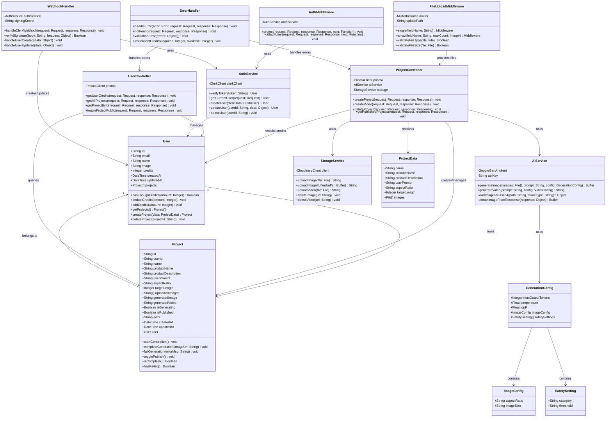

# Class Diagram

## UGC Image Generator - Object-Oriented Design

This diagram shows the class structure and relationships in the application.



## Class Details

### Domain Models

#### **User**
```typescript
class User {
    // Properties
    id: string                    // Clerk User ID (PK)
    email: string                 // User email
    name: string                  // Full name
    image: string                 // Profile picture URL
    credits: number               // Available credits (default: 20)
    createdAt: Date              // Account creation date
    updatedAt: Date              // Last update timestamp
    projects: Project[]           // User's projects (relation)
    
    // Methods
    hasEnoughCredits(amount: number): boolean {
        return this.credits >= amount;
    }
    
    deductCredits(amount: number): void {
        if (this.hasEnoughCredits(amount)) {
            this.credits -= amount;
        } else {
            throw new InsufficientCreditsError();
        }
    }
    
    addCredits(amount: number): void {
        this.credits += amount;
    }
    
    getProjects(): Project[] {
        return this.projects.sort((a, b) => 
            b.createdAt.getTime() - a.createdAt.getTime()
        );
    }
    
    createProject(data: ProjectData): Project {
        if (!this.hasEnoughCredits(5)) {
            throw new InsufficientCreditsError();
        }
        this.deductCredits(5);
        return new Project({ ...data, userId: this.id });
    }
    
    deleteProject(projectId: string): void {
        const project = this.projects.find(p => p.id === projectId);
        if (project) {
            project.delete();
        }
    }
}
```

#### **Project**
```typescript
class Project {
    // Properties
    id: string                    // UUID (PK)
    userId: string                // FK to User
    name: string                  // Project name
    productName: string           // Product being showcased
    productDescription: string    // Optional details
    userPrompt: string            // Custom AI prompt
    aspectRatio: string           // "9:16" or "16:9"
    targetLength: number          // Video length (seconds)
    uploadedImages: string[]      // Cloudinary URLs
    generatedImage: string        // AI output URL
    generatedVideo: string        // Video output URL
    isGenerating: boolean         // Processing flag
    isPublished: boolean          // Public visibility
    error: string                 // Error message
    createdAt: Date
    updatedAt: Date
    user: User                    // Relation
    
    // Methods
    startGeneration(): void {
        this.isGenerating = true;
        this.error = "";
    }
    
    completeGeneration(imageUrl: string): void {
        this.generatedImage = imageUrl;
        this.isGenerating = false;
    }
    
    failGeneration(errorMsg: string): void {
        this.error = errorMsg;
        this.isGenerating = false;
        // Refund credits to user
        this.user.addCredits(5);
    }
    
    togglePublish(): void {
        if (this.isComplete()) {
            this.isPublished = !this.isPublished;
        }
    }
    
    isComplete(): boolean {
        return !this.isGenerating && 
               this.generatedImage !== "" && 
               this.error === "";
    }
    
    hasFailed(): boolean {
        return this.error !== "";
    }
    
    canGenerateVideo(): boolean {
        return this.isComplete() && 
               this.user.hasEnoughCredits(10);
    }
}
```

### Service Classes

#### **AuthService**
```typescript
class AuthService {
    private clerkClient: ClerkClient;
    
    constructor(clerkPublishableKey: string, clerkSecretKey: string) {
        this.clerkClient = new ClerkClient({
            publishableKey: clerkPublishableKey,
            secretKey: clerkSecretKey
        });
    }
    
    async verifyToken(token: string): Promise<User> {
        const clerkUser = await this.clerkClient.verifyToken(token);
        return await this.findOrCreateUser(clerkUser);
    }
    
    getCurrentUser(request: Request): User {
        const userId = request.auth().userId;
        return prisma.user.findUnique({ where: { id: userId } });
    }
    
    async createUser(clerkData: ClerkUser): Promise<User> {
        return await prisma.user.create({
            data: {
                id: clerkData.id,
                email: clerkData.emailAddresses[0].emailAddress,
                name: `${clerkData.firstName} ${clerkData.lastName}`,
                image: clerkData.imageUrl,
                credits: 20
            }
        });
    }
    
    async updateUser(userId: string, data: Partial<User>): Promise<User> {
        return await prisma.user.update({
            where: { id: userId },
            data
        });
    }
    
    async deleteUser(userId: string): Promise<void> {
        await prisma.user.delete({ where: { id: userId } });
    }
}
```

#### **AIService**
```typescript
class AIService {
    private client: GoogleGenAI;
    private apiKey: string;
    
    constructor(apiKey: string) {
        this.apiKey = apiKey;
        this.client = new GoogleGenAI({ apiKey });
    }
    
    async generateImage(
        images: File[], 
        prompt: string, 
        config: GenerationConfig
    ): Promise<Buffer> {
        const img1 = this.loadImageToBase64(images[0].path, images[0].mimetype);
        const img2 = this.loadImageToBase64(images[1].path, images[1].mimetype);
        
        const fullPrompt = {
            text: `Combine the person and product into a realistic photo.
                   Make the person naturally hold or use the product.
                   Match lighting, shadows, scale and perspective.
                   Professional studio lighting. Ecommerce-quality.
                   ${prompt}`
        };
        
        const response = await this.client.models.generateContent({
            model: "gemini-3-pro-image-preview",
            contents: [img1, img2, fullPrompt],
            config
        });
        
        return this.extractImageFromResponse(response);
    }
    
    async generateVideo(prompt: string, config: VideoConfig): Promise<string> {
        const response = await this.client.models.generateContent({
            model: "veo-3.1",
            contents: [{ text: prompt }],
            config
        });
        
        return response.videoUrl;
    }
    
    private loadImageToBase64(path: string, mimeType: string): object {
        return {
            inlineData: {
                data: fs.readFileSync(path).toString("base64"),
                mimeType
            }
        };
    }
    
    private extractImageFromResponse(response: any): Buffer {
        const parts = response.candidates[0].content.parts;
        for (const part of parts) {
            if (part.inlineData) {
                return Buffer.from(part.inlineData.data, "base64");
            }
        }
        throw new Error("No image data in response");
    }
}
```

#### **StorageService**
```typescript
class StorageService {
    private client: CloudinaryClient;
    
    constructor(cloudinaryUrl: string) {
        this.client = cloudinary.config({ url: cloudinaryUrl });
    }
    
    async uploadImage(file: File): Promise<string> {
        const result = await cloudinary.uploader.upload(file.path, {
            resource_type: "image",
            folder: "ugc-generator/images"
        });
        return result.secure_url;
    }
    
    async uploadImageBuffer(buffer: Buffer): Promise<string> {
        const base64 = `data:image/png;base64,${buffer.toString("base64")}`;
        const result = await cloudinary.uploader.upload(base64, {
            resource_type: "image",
            folder: "ugc-generator/generated"
        });
        return result.secure_url;
    }
    
    async uploadVideo(file: File): Promise<string> {
        const result = await cloudinary.uploader.upload(file.path, {
            resource_type: "video",
            folder: "ugc-generator/videos"
        });
        return result.secure_url;
    }
    
    async deleteImage(url: string): Promise<void> {
        const publicId = this.extractPublicId(url);
        await cloudinary.uploader.destroy(publicId);
    }
    
    async deleteVideo(url: string): Promise<void> {
        const publicId = this.extractPublicId(url);
        await cloudinary.uploader.destroy(publicId, { resource_type: "video" });
    }
    
    private extractPublicId(url: string): string {
        const parts = url.split("/");
        return parts[parts.length - 1].split(".")[0];
    }
}
```

### Controller Classes

#### **ProjectController**
```typescript
class ProjectController {
    private prisma: PrismaClient;
    private aiService: AIService;
    private storage: StorageService;
    
    constructor(
        prisma: PrismaClient,
        aiService: AIService,
        storage: StorageService
    ) {
        this.prisma = prisma;
        this.aiService = aiService;
        this.storage = storage;
    }
    
    async createProject(req: Request, res: Response): Promise<void> {
        const { userId } = req.auth();
        const projectData: ProjectData = req.body;
        const images: File[] = req.files as File[];
        
        try {
            // Check credits
            const user = await this.prisma.user.findUnique({ 
                where: { id: userId } 
            });
            
            if (!user?.hasEnoughCredits(5)) {
                throw new InsufficientCreditsError();
            }
            
            // Deduct credits
            await this.prisma.user.update({
                where: { id: userId },
                data: { credits: { decrement: 5 } }
            });
            
            // Upload original images
            const uploadedUrls = await Promise.all(
                images.map(img => this.storage.uploadImage(img))
            );
            
            // Create project
            const project = await this.prisma.project.create({
                data: {
                    userId,
                    ...projectData,
                    uploadedImages: uploadedUrls,
                    isGenerating: true
                }
            });
            
            // Generate image with AI
            const generatedBuffer = await this.aiService.generateImage(
                images,
                projectData.userPrompt,
                this.getGenerationConfig(projectData.aspectRatio)
            );
            
            // Upload generated image
            const generatedUrl = await this.storage.uploadImageBuffer(
                generatedBuffer
            );
            
            // Update project
            await this.prisma.project.update({
                where: { id: project.id },
                data: {
                    generatedImage: generatedUrl,
                    isGenerating: false
                }
            });
            
            res.json({ projectId: project.id });
        } catch (error) {
            // Refund credits on failure
            await this.prisma.user.update({
                where: { id: userId },
                data: { credits: { increment: 5 } }
            });
            throw error;
        }
    }
    
    async createVideo(req: Request, res: Response): Promise<void> {
        // Implementation for video generation
    }
    
    async deleteProject(req: Request, res: Response): Promise<void> {
        const { userId } = req.auth();
        const { projectId } = req.params;
        
        await this.prisma.project.delete({
            where: { id: projectId, userId }
        });
        
        res.json({ message: "Project deleted" });
    }
    
    async getPublishedProjects(req: Request, res: Response): Promise<void> {
        const projects = await this.prisma.project.findMany({
            where: { isPublished: true },
            include: { user: { select: { name: true, image: true } } },
            orderBy: { createdAt: "desc" }
        });
        
        res.json({ projects });
    }
    
    private getGenerationConfig(aspectRatio: string): GenerationConfig {
        return {
            maxOutputTokens: 32768,
            temperature: 1,
            topP: 0.95,
            imageConfig: { aspectRatio, imageSize: "1k" },
            safetySettings: [/* ... */]
        };
    }
}
```

### Middleware Classes

#### **AuthMiddleware**
```typescript
class AuthMiddleware {
    private authService: AuthService;
    
    constructor(authService: AuthService) {
        this.authService = authService;
    }
    
    async protect(
        req: Request, 
        res: Response, 
        next: NextFunction
    ): Promise<void> {
        try {
            const { userId } = req.auth();
            
            if (!userId) {
                res.status(401).json({ message: "Unauthorized" });
                return;
            }
            
            next();
        } catch (error) {
            res.status(401).json({ message: "Invalid token" });
        }
    }
    
    async attachUser(
        req: Request, 
        res: Response, 
        next: NextFunction
    ): Promise<void> {
        const { userId } = req.auth();
        if (userId) {
            req.user = await this.authService.getCurrentUser(req);
        }
        next();
    }
}
```

#### **FileUploadMiddleware**
```typescript
class FileUploadMiddleware {
    private multer: MulterInstance;
    private uploadPath: string;
    
    constructor(uploadPath: string = "./uploads") {
        this.uploadPath = uploadPath;
        this.multer = multer({
            storage: multer.diskStorage({
                destination: uploadPath,
                filename: (req, file, cb) => {
                    cb(null, `${Date.now()}-${file.originalname}`);
                }
            }),
            fileFilter: this.validateFileType.bind(this),
            limits: { fileSize: 5 * 1024 * 1024 } // 5MB
        });
    }
    
    single(fieldName: string): Middleware {
        return this.multer.single(fieldName);
    }
    
    array(fieldName: string, maxCount: number = 2): Middleware {
        return this.multer.array(fieldName, maxCount);
    }
    
    validateFileType(
        req: Request, 
        file: File, 
        cb: Function
    ): void {
        const allowedTypes = /jpeg|jpg|png/;
        const isValid = allowedTypes.test(path.extname(file.originalname)) &&
                       allowedTypes.test(file.mimetype);
        cb(isValid ? null : new Error("Invalid file type"), isValid);
    }
    
    validateFileSize(file: File): boolean {
        return file.size <= 5 * 1024 * 1024;
    }
}
```

## Design Patterns Used

### 1. **MVC Pattern**
- **Model**: User, Project (Prisma models)
- **View**: React components (separate codebase)
- **Controller**: ProjectController, UserController

### 2. **Service Layer Pattern**
- Business logic separated into services
- Controllers delegate to services
- Services are reusable and testable

### 3. **Repository Pattern**
- Prisma ORM acts as repository
- Abstracts database operations
- Provides clean API for data access

### 4. **Dependency Injection**
- Controllers receive dependencies via constructor
- Makes testing easier
- Loose coupling between components

### 5. **Middleware Chain Pattern**
- Express middleware pipeline
- Request processing in stages
- Reusable middleware components

### 6. **Factory Pattern**
- GenerationConfig creation
- Multer instance configuration
- Service instantiation

## SOLID Principles

### Single Responsibility
- Each class has one reason to change
- AuthService only handles authentication
- StorageService only handles file storage

### Open/Closed
- Services are open for extension
- Closed for modification
- New services can be added without changing existing code

### Liskov Substitution
- Services implement interfaces
- Can be swapped with mock implementations for testing

### Interface Segregation
- Controllers don't depend on entire Prisma client
- Only use methods they need

### Dependency Inversion
- High-level modules depend on abstractions
- Services injected, not instantiated directly

---

**Diagram Type**: Class Diagram  
**Notation**: UML  
**Created**: February 18, 2026  
**Version**: 1.0.0
