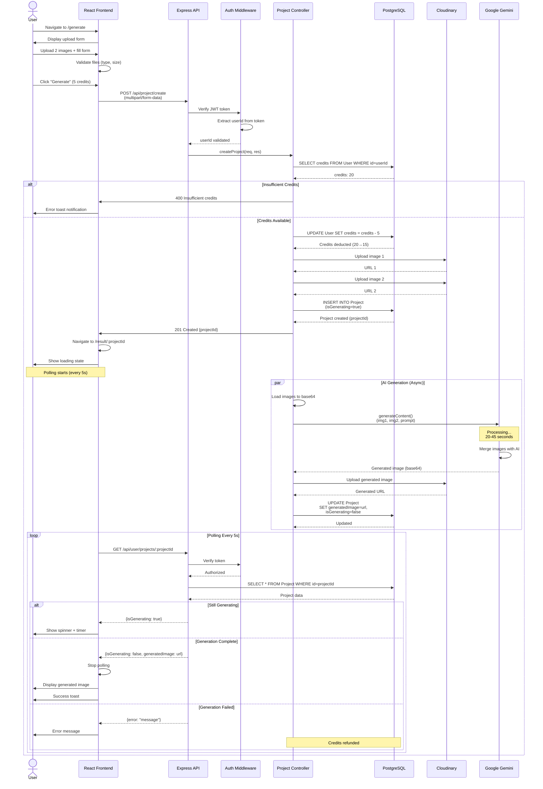
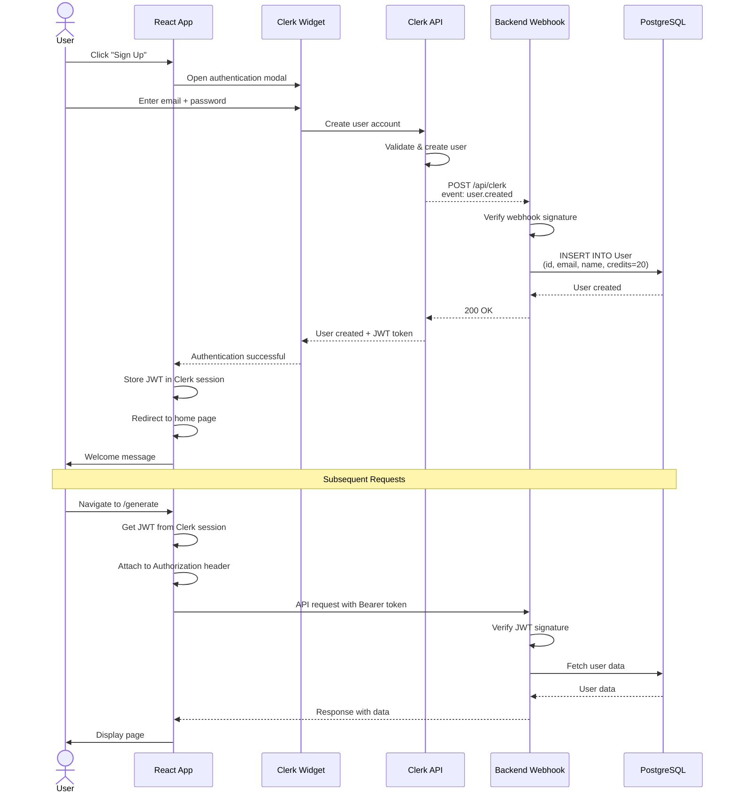
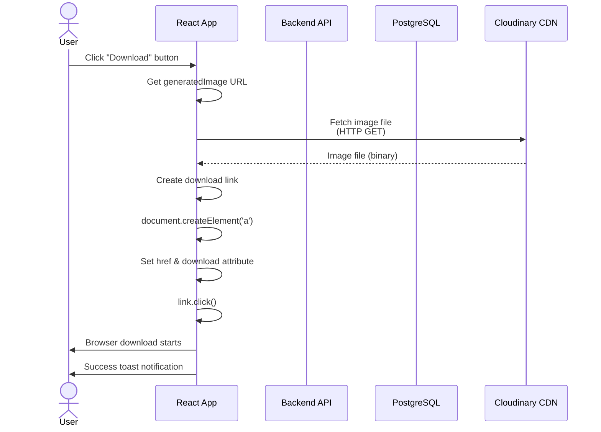
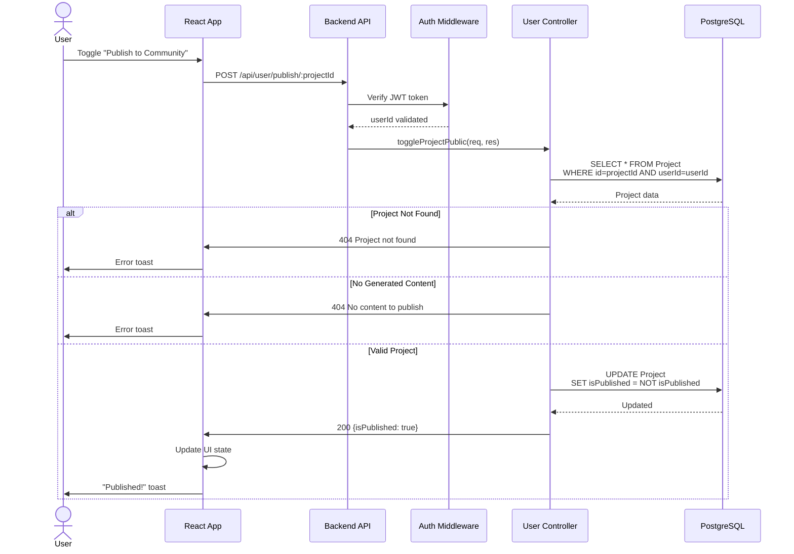
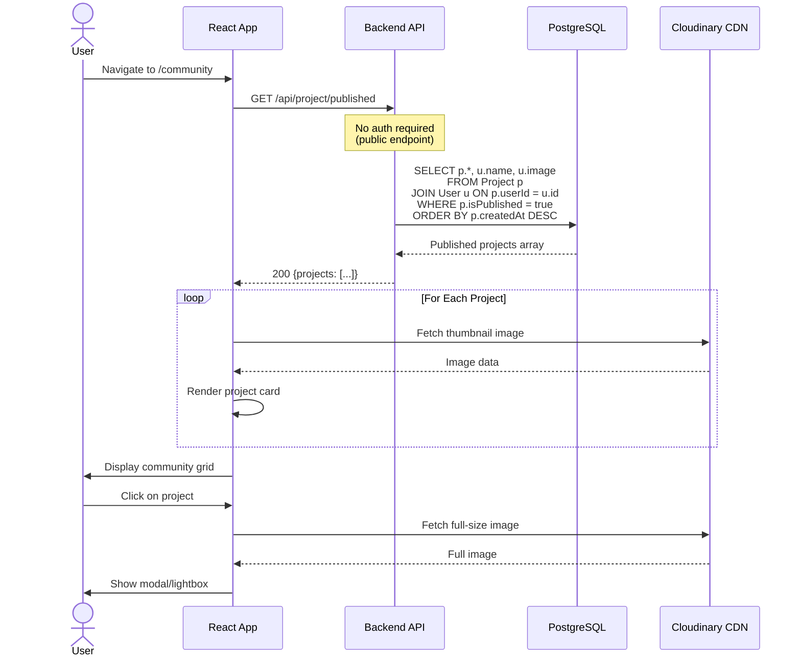
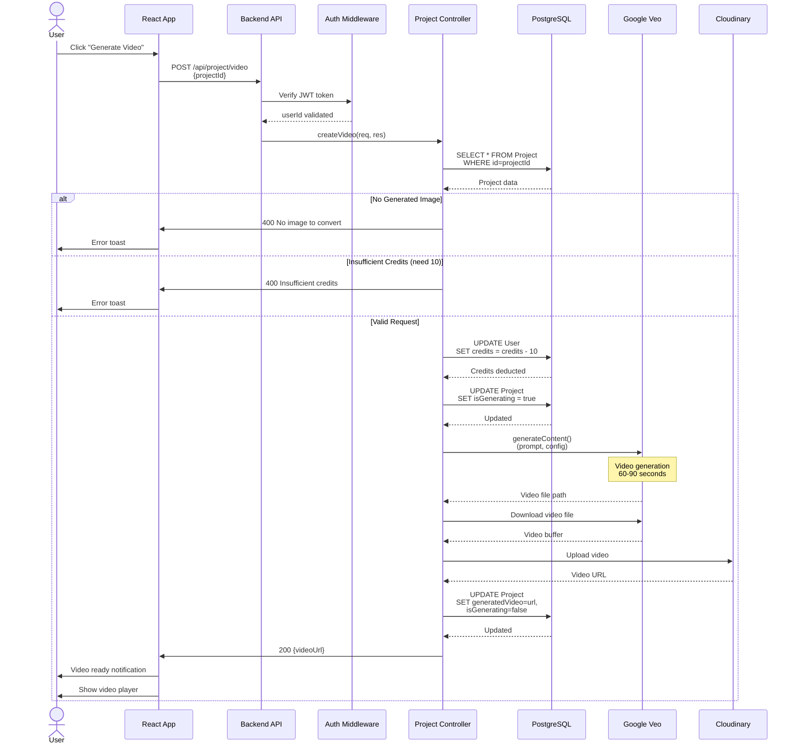
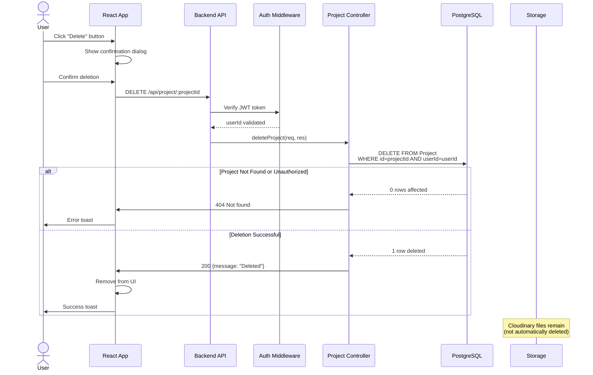
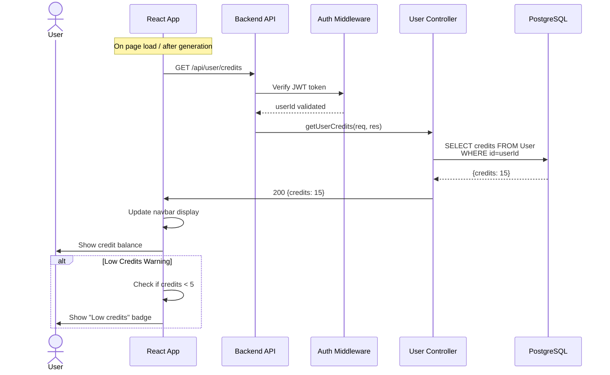
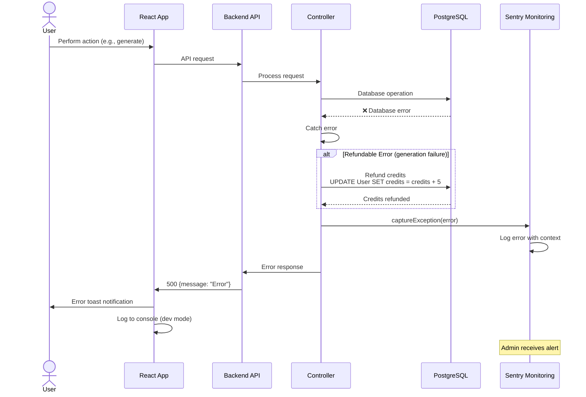
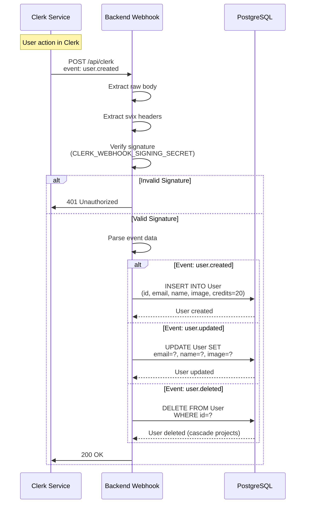

# Sequence Diagram

## UGC Image Generator - Interaction Flows

This diagram shows the detailed sequence of interactions between components over time.

## 1. Image Generation Sequence



## 2. User Authentication Sequence



## 3. Download Generated Image Sequence



## 4. Publish to Community Sequence



## 5. View Community Feed Sequence



## 6. Video Generation Sequence



## 7. Delete Project Sequence



## 8. Credit Check Sequence



## 9. Error Handling Sequence



## 10. Webhook Processing Sequence



## Timing Diagrams

### Image Generation Timeline

```
User Upload → Credit Check → Deduction → Create Project → Cloudinary Upload → AI Processing → Result Upload → DB Update → Poll Success
     |            |             |              |                 |                  |                 |              |            |
     0s          0.5s          0.5s           1s               2s              5-45s            46s           46.5s        47s
     
     ←─ Frontend ─→←───────────────────── Backend Async Processing ─────────────────────→←─ Frontend Poll ─→
```

### Polling Mechanism Timeline

```
Navigate to Result → Initial Fetch → Poll #1 → Poll #2 → Poll #3 → ... → Poll #N → Complete
       |                  |            |          |          |               |           |
       0s                0s          5s        10s        15s            (N*5)s     (N*5)s
       
Status: isGenerating=true  →  true  →  true  →  true  →  ... →  false  → Stop Polling
```

## Sequence Patterns

### 1. **Request-Response Pattern**
- Client sends request
- Server processes synchronously
- Server sends response
- Used for: Credits, Projects list, Delete

### 2. **Async Processing Pattern**
- Client sends request
- Server starts background job
- Server responds immediately with job ID
- Client polls for status
- Used for: Image generation, Video generation

### 3. **Webhook Pattern**
- External service triggers webhook
- Server verifies signature
- Server processes event
- Server responds with status
- Used for: User sync from Clerk

### 4. **Middleware Chain Pattern**
- Request passes through multiple middleware
- Each middleware performs validation/transformation
- Final middleware calls controller
- Used for: Authentication, File upload

---

**Diagram Type**: Sequence Diagram  
**Notation**: UML Sequence (Mermaid)  
**Created**: February 18, 2026  
**Version**: 1.0.0
