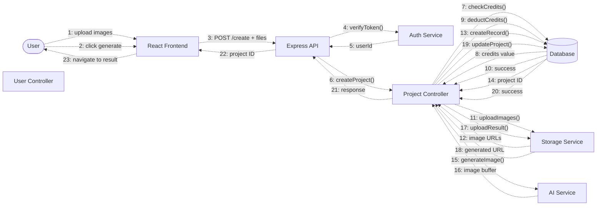
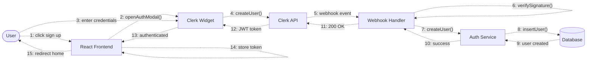
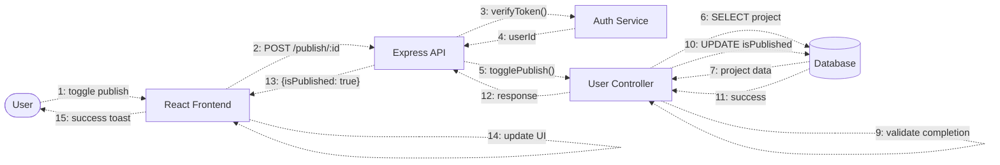
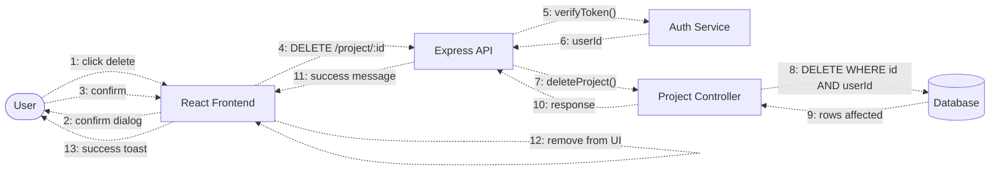
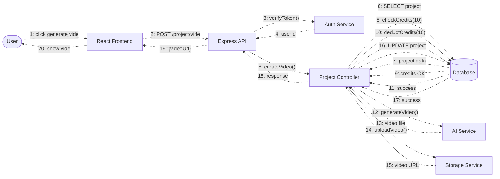

# Collaboration Diagram

## UGC Image Generator - Object Collaboration

Collaboration diagrams show how objects interact to accomplish a specific task, with numbered message sequences.

## 1. Image Generation Collaboration



**Message Flow:**
1. User uploads 2 images to Frontend
2. User clicks "Generate Image" button
3. Frontend sends POST request with files to API
4. API calls Auth Service to verify JWT token
5. Auth Service returns userId
6. API delegates to Project Controller
7. Project Controller checks user credits in Database
8. Database returns credit balance
9. Project Controller deducts 5 credits
10. Database confirms deduction
11. Project Controller uploads original images to Storage
12. Storage Service returns Cloudinary URLs
13. Project Controller creates project record in Database
14. Database returns new project ID
15. Project Controller calls AI Service to generate image
16. AI Service returns generated image buffer
17. Project Controller uploads generated image to Storage
18. Storage Service returns generated image URL
19. Project Controller updates project with result
20. Database confirms update
21. Project Controller sends response to API
22. API returns project ID to Frontend
23. Frontend navigates user to result page

---

## 2. User Authentication Collaboration



**Message Flow:**
1. User clicks "Sign Up" button
2. Frontend opens Clerk authentication modal
3. User enters email and password
4. Clerk Widget calls Clerk API to create user
5. Clerk API sends webhook event to Backend
6. Webhook Handler verifies webhook signature
7. Webhook Handler calls Auth Service to create user
8. Auth Service inserts user into Database with 20 credits
9. Database returns created user
10. Auth Service returns success to Webhook Handler
11. Webhook Handler responds 200 OK to Clerk API
12. Clerk API returns JWT token to Clerk Widget
13. Clerk Widget notifies Frontend of authentication success
14. Frontend stores JWT token in session
15. Frontend redirects user to home page

---

## 3. Result Polling Collaboration

```mermaid
graph LR
    User([User])
    Frontend[React Frontend]
    API[Express API]
    Auth[Auth Service]
    UserCtrl[User Controller]
    DB[(Database)]
    
    Frontend -.1: pollProject().-> Frontend
    Frontend -.2: GET /projects/:id.-> API
    API -.3: verifyToken().-> Auth
    Auth -.4: userId.-> API
    API -.5: getProjectById().-> UserCtrl
    UserCtrl -.6: SELECT project.-> DB
    DB -.7: project data.-> UserCtrl
    UserCtrl -.8: response.-> API
    API -.9: project JSON.-> Frontend
    Frontend -.10: checkStatus().-> Frontend
    
    alt isGenerating === true
        Frontend -.11a: setTimeout(5s).-> Frontend
        Frontend -.12a: repeat poll.-> Frontend
    else isGenerating === false
        Frontend -.11b: stopPolling().-> Frontend
        Frontend -.12b: displayImage().-> User
    end
```

**Message Flow:**
1. Frontend starts polling mechanism
2. Frontend sends GET request for project status
3. API calls Auth Service to verify token
4. Auth Service returns userId
5. API delegates to User Controller
6. User Controller queries Database for project
7. Database returns project data
8. User Controller formats response
9. API returns project JSON to Frontend
10. Frontend checks isGenerating status
11a. If still generating: Frontend sets 5-second timeout
12a. Polling repeats from step 2
11b. If complete: Frontend stops polling
12b. Frontend displays generated image to User

---

## 4. Publish to Community Collaboration



**Message Flow:**
1. User toggles "Publish to Community" switch
2. Frontend sends POST request to publish endpoint
3. API calls Auth Service to verify token
4. Auth Service returns userId
5. API delegates to User Controller
6. User Controller fetches project from Database
7. Database returns project data
8. User Controller validates user owns project
9. User Controller validates project has generated content
10. User Controller toggles isPublished field
11. Database confirms update
12. User Controller formats response
13. API returns new publish status
14. Frontend updates UI state
15. Frontend shows success notification to User

---

## 5. Download Image Collaboration

```mermaid
graph LR
    User([User])
    Frontend[React Frontend]
    CDN[Cloudinary CDN]
    Browser[Browser]
    
    User -.1: click download.-> Frontend
    Frontend -.2: getImageUrl().-> Frontend
    Frontend -.3: createDownloadLink().-> Frontend
    Frontend -.4: fetch image.-> CDN
    CDN -.5: image file.-> Frontend
    Frontend -.6: createElement('a').-> Frontend
    Frontend -.7: set href + download.-> Frontend
    Frontend -.8: link.click().-> Browser
    Browser -.9: download file.-> User
    Frontend -.10: success toast.-> User
```

**Message Flow:**
1. User clicks "Download" button
2. Frontend retrieves generatedImage URL from state
3. Frontend creates download link element
4. Frontend fetches image from Cloudinary CDN
5. CDN returns image file
6. Frontend creates anchor element
7. Frontend sets href and download attributes
8. Frontend programmatically clicks link
9. Browser downloads file to User's device
10. Frontend shows success notification

---

## 6. Delete Project Collaboration



**Message Flow:**
1. User clicks "Delete" button on project card
2. Frontend shows confirmation dialog
3. User confirms deletion
4. Frontend sends DELETE request with project ID
5. API calls Auth Service to verify token
6. Auth Service returns userId
7. API delegates to Project Controller
8. Project Controller deletes project (WHERE id AND userId for security)
9. Database returns number of rows affected
10. Project Controller formats response
11. API returns success message
12. Frontend removes project from UI immediately
13. Frontend shows success notification

---

## 7. Video Generation Collaboration



**Message Flow:**
1. User clicks "Generate Video" button
2. Frontend sends POST request for video generation
3. API calls Auth Service to verify token
4. Auth Service returns userId
5. API delegates to Project Controller
6. Project Controller fetches project from Database
7. Database returns project data with generated image
8. Project Controller checks if user has 10 credits
9. Database confirms sufficient credits
10. Project Controller deducts 10 credits
11. Database confirms deduction
12. Project Controller calls AI Service to generate video
13. AI Service returns video file
14. Project Controller uploads video to Storage Service
15. Storage Service returns Cloudinary video URL
16. Project Controller updates project with video URL
17. Database confirms update
18. Project Controller formats response
19. API returns video URL to Frontend
20. Frontend displays video player to User

---

## 8. Community Feed Collaboration

```mermaid
graph LR
    User([User])
    Frontend[React Frontend]
    API[Express API]
    ProjectCtrl[Project Controller]
    DB[(Database)]
    CDN[Cloudinary CDN]
    
    User -.1: navigate /community.-> Frontend
    Frontend -.2: GET /project/published.-> API
    API -.3: getPublishedProjects().-> ProjectCtrl
    ProjectCtrl -.4: SELECT published.-> DB
    DB -.5: projects array.-> ProjectCtrl
    ProjectCtrl -.6: join user data.-> DB
    DB -.7: projects + users.-> ProjectCtrl
    ProjectCtrl -.8: response.-> API
    API -.9: projects JSON.-> Frontend
    
    loop For Each Project
        Frontend -.10: fetch thumbnail.-> CDN
        CDN -.11: image data.-> Frontend
        Frontend -.12: render card.-> Frontend
    end
    
    Frontend -.13: display grid.-> User
```

**Message Flow:**
1. User navigates to /community page
2. Frontend requests published projects from API
3. API delegates to Project Controller
4. Project Controller queries Database for published projects
5. Database returns projects where isPublished = true
6. Project Controller joins with User table for author info
7. Database returns projects with user names and avatars
8. Project Controller formats response
9. API returns projects JSON array to Frontend
10. For each project: Frontend fetches thumbnail from CDN
11. CDN returns image data
12. Frontend renders project card
13. Frontend displays grid of community projects to User

---

## Collaboration Patterns

### 1. **Controller-Service-Repository Pattern**
```
Controller → Service → Database
    ↓          ↓
Response ← Data Processing
```

### 2. **Authentication Flow Pattern**
```
Request → API → Auth Service → Token Verification
                      ↓
                   userId
                      ↓
                 Controller
```

### 3. **Async Job Pattern**
```
Controller → Start Job → Immediate Response
     ↓
Background Processing
     ↓
Database Update
     ↓
Frontend Polling Detects Change
```

### 4. **External Service Integration Pattern**
```
Controller → External Service (AI/Storage)
     ↓              ↓
   Retry       Response
     ↓              ↓
 Database ← Store Result
```

## Object Responsibilities

| Object | Responsibilities |
|--------|-----------------|
| **Frontend** | User interaction, API calls, state management, UI rendering |
| **API** | Route handling, middleware orchestration, response formatting |
| **Auth Service** | Token verification, user context, session management |
| **Project Controller** | Business logic, orchestration, transaction management |
| **User Controller** | User-specific queries, credit management |
| **AI Service** | Image/video generation, prompt engineering, API integration |
| **Storage Service** | File upload/download, URL generation, CDN integration |
| **Database** | Data persistence, query execution, relationship management |
| **Webhook Handler** | Event processing, signature verification, sync operations |

## Message Types

- **Solid Lines (→)**: Synchronous calls
- **Dashed Lines (-.->)**: Object interactions with sequence
- **Numbers (1, 2, 3...)**: Message sequence order
- **alt/loop**: Conditional flows

---

**Diagram Type**: Collaboration Diagram  
**Notation**: UML Collaboration (Object-Message)  
**Created**: February 18, 2026  
**Version**: 1.0.0
