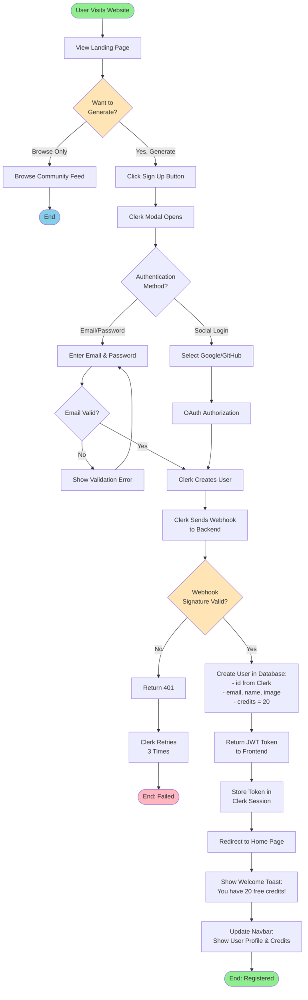
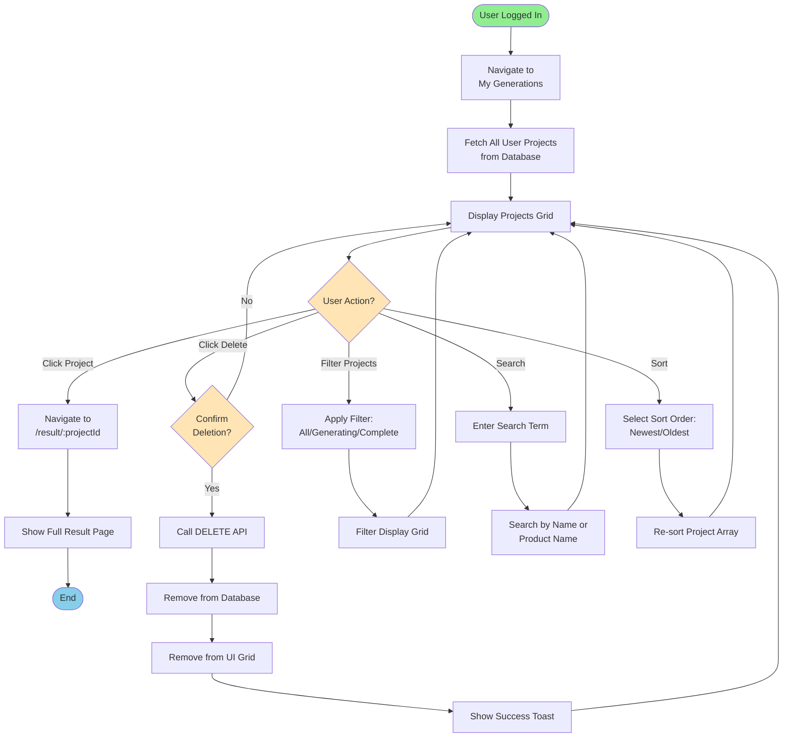
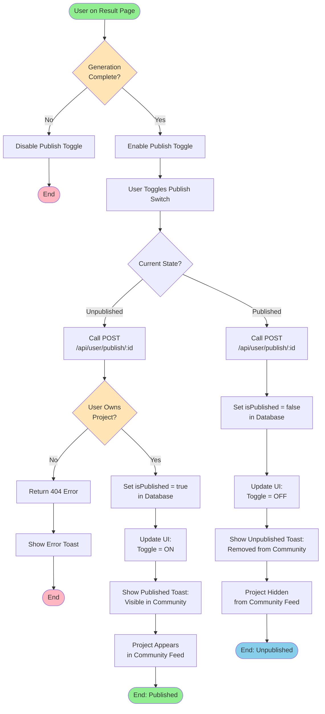
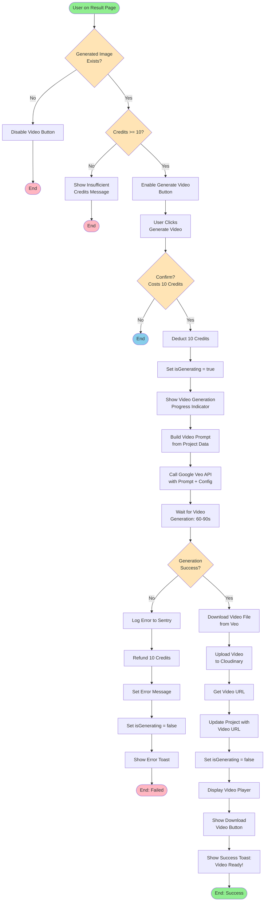
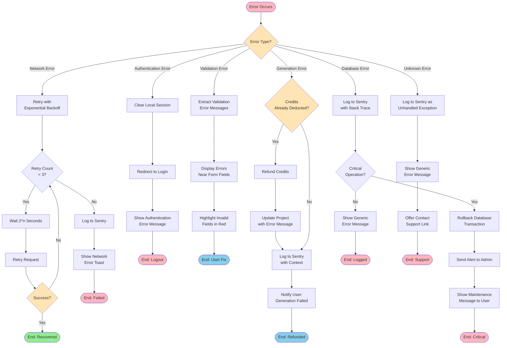

# Activity Diagram

## UGC Image Generator - Process Flows

Activity diagrams show the workflow of business processes and system operations.

## 1. Image Generation Process Flow

```mermaid
flowchart TD
    Start([User Starts Generation]) --> CheckAuth{User<br/>Authenticated?}
    
    CheckAuth -->|No| RedirectLogin[Redirect to Login]
    RedirectLogin --> End1([End])
    
    CheckAuth -->|Yes| NavigateGen[Navigate to /generate]
    NavigateGen --> UploadImg[Upload 2 Images]
    
    UploadImg --> ValidateFiles{Files Valid?<br/>Type & Size}
    ValidateFiles -->|No| ShowError1[Show Error Message]
    ShowError1 --> UploadImg
    
    ValidateFiles -->|Yes| FillForm[Fill Form Fields:<br/>Name, Product, Prompt]
    FillForm --> SelectRatio[Select Aspect Ratio]
    SelectRatio --> ClickGenerate[Click Generate Button]
    
    ClickGenerate --> CheckCredits{Credits >= 5?}
    CheckCredits -->|No| ShowLowCredits[Show Insufficient<br/>Credits Error]
    ShowLowCredits --> End2([End])
    
    CheckCredits -->|Yes| DeductCredits[Deduct 5 Credits]
    DeductCredits --> UploadToCloud[Upload Images<br/>to Cloudinary]
    
    UploadToCloud --> CreateProject[Create Project Record<br/>isGenerating = true]
    CreateProject --> RedirectResult[Redirect to<br/>/result/:projectId]
    
    RedirectResult --> ShowLoading[Show Loading Spinner]
    
    par Async AI Processing
        CreateProject --> PrepareImages[Load Images to Base64]
        PrepareImages --> BuildPrompt[Build AI Prompt]
        BuildPrompt --> CallGemini[Call Google Gemini API]
        CallGemini --> WaitAI[Wait for AI<br/>20-45 seconds]
        WaitAI --> ReceiveResult{Generation<br/>Successful?}
        
        ReceiveResult -->|No| LogError[Log Error to Sentry]
        LogError --> RefundCredits[Refund 5 Credits]
        RefundCredits --> UpdateError[Update Project<br/>with Error Message]
        UpdateError --> SetGeneratingFalse1[Set isGenerating = false]
        
        ReceiveResult -->|Yes| ExtractImage[Extract Image Buffer]
        ExtractImage --> UploadResult[Upload Generated Image<br/>to Cloudinary]
        UploadResult --> UpdateProject[Update Project with<br/>Generated Image URL]
        UpdateProject --> SetGeneratingFalse2[Set isGenerating = false]
    end
    
    ShowLoading --> StartPolling[Start Polling<br/>Every 5 Seconds]
    StartPolling --> FetchStatus[Fetch Project Status]
    FetchStatus --> CheckGenerating{isGenerating?}
    
    CheckGenerating -->|true| Wait5Sec[Wait 5 Seconds]
    Wait5Sec --> FetchStatus
    
    CheckGenerating -->|false| CheckError{Has Error?}
    CheckError -->|Yes| DisplayError[Display Error Message<br/>Show Refund Notice]
    DisplayError --> End3([End])
    
    CheckError -->|No| DisplayImage[Display Generated Image]
    DisplayImage --> ShowActions[Show Action Buttons:<br/>Download, Publish, Video]
    ShowActions --> End4([End: Success])
    
    style Start fill:#90EE90
    style End1 fill:#FFB6C1
    style End2 fill:#FFB6C1
    style End3 fill:#FFB6C1
    style End4 fill:#90EE90
    style CheckCredits fill:#FFE4B5
    style CheckAuth fill:#FFE4B5
    style ValidateFiles fill:#FFE4B5
    style ReceiveResult fill:#FFE4B5
```

## 2. User Registration & Onboarding Flow



## 3. Project Management Flow



## 4. Community Publishing Flow



## 5. Video Generation Flow



## 6. Download Generated Content Flow

```mermaid
flowchart TD
    Start([User Viewing Result]) --> HasContent{Generated Content<br/>Available?}
    
    HasContent -->|No| DisableDownload[Disable Download Button]
    DisableDownload --> End1([End])
    
    HasContent -->|Yes| EnableDownload[Enable Download Button]
    EnableDownload --> ClickDownload[User Clicks Download]
    
    ClickDownload --> ChooseType{Download Type?}
    
    ChooseType -->|Image| GetImageURL[Get Generated<br/>Image URL]
    GetImageURL --> FetchImage[Fetch Image from<br/>Cloudinary CDN]
    FetchImage --> CreateImageLink[Create Download Link:<br/>createElement('a')]
    CreateImageLink --> SetImageAttrs[Set href & download<br/>attributes]
    SetImageAttrs --> TriggerImageDownload[Programmatically<br/>Click Link]
    TriggerImageDownload --> BrowserImageDownload[Browser Initiates<br/>Image Download]
    BrowserImageDownload --> ShowImageToast[Show Success Toast:<br/>Image Downloaded]
    ShowImageToast --> End2([End: Image])
    
    ChooseType -->|Video| CheckVideoExists{Video<br/>Generated?}
    CheckVideoExists -->|No| ShowNoVideo[Show No Video<br/>Available Message]
    ShowNoVideo --> End3([End])
    
    CheckVideoExists -->|Yes| GetVideoURL[Get Generated<br/>Video URL]
    GetVideoURL --> FetchVideo[Fetch Video from<br/>Cloudinary CDN]
    FetchVideo --> CreateVideoLink[Create Download Link]
    CreateVideoLink --> SetVideoAttrs[Set href & download<br/>attributes]
    SetVideoAttrs --> TriggerVideoDownload[Programmatically<br/>Click Link]
    TriggerVideoDownload --> BrowserVideoDownload[Browser Initiates<br/>Video Download]
    BrowserVideoDownload --> ShowVideoToast[Show Success Toast:<br/>Video Downloaded]
    ShowVideoToast --> End4([End: Video])
    
    style Start fill:#90EE90
    style End1 fill:#FFB6C1
    style End2 fill:#90EE90
    style End3 fill:#FFB6C1
    style End4 fill:#90EE90
    style HasContent fill:#FFE4B5
    style ChooseType fill:#FFE4B5
    style CheckVideoExists fill:#FFE4B5
```

## 7. Credit Management Flow

```mermaid
flowchart TD
    Start([Credit Operation]) --> OperationType{Operation Type?}
    
    OperationType -->|Check Balance| FetchCredits[Query User Credits<br/>from Database]
    FetchCredits --> DisplayCredits[Display in Navbar]
    DisplayCredits --> CheckLow{Credits < 5?}
    CheckLow -->|Yes| ShowWarning[Show Low Credits<br/>Warning Badge]
    CheckLow -->|No| HideWarning[Hide Warning]
    ShowWarning --> End1([End])
    HideWarning --> End1
    
    OperationType -->|Deduct Credits| ValidateAmount{Amount Valid?<br/>5 or 10}
    ValidateAmount -->|No| ThrowError[Throw Invalid<br/>Amount Error]
    ThrowError --> End2([End: Error])
    
    ValidateAmount -->|Yes| CheckSufficient{Current Credits<br/>>= Amount?}
    CheckSufficient -->|No| ReturnInsufficient[Return Insufficient<br/>Credits Error]
    ReturnInsufficient --> End3([End: Failed])
    
    CheckSufficient -->|Yes| UpdateDeduct[UPDATE User<br/>SET credits = credits - amount]
    UpdateDeduct --> LogTransaction[Log Transaction<br/>(future)]
    LogTransaction --> RefreshUI[Refresh Credit Display]
    RefreshUI --> End4([End: Deducted])
    
    OperationType -->|Refund Credits| ValidateRefund{Refund Reason?<br/>Generation Failed}
    ValidateRefund -->|Valid| UpdateAdd[UPDATE User<br/>SET credits = credits + amount]
    UpdateAdd --> LogRefund[Log Refund<br/>(future)]
    LogRefund --> NotifyUser[Notify User:<br/>Credits Refunded]
    NotifyUser --> End5([End: Refunded])
    
    ValidateRefund -->|Invalid| RejectRefund[Reject Refund]
    RejectRefund --> End6([End: Rejected])
    
    OperationType -->|Purchase Credits| RedirectPayment[Redirect to<br/>Stripe Checkout]
    RedirectPayment --> WaitPayment[Wait for Payment<br/>Confirmation]
    WaitPayment --> PaymentResult{Payment<br/>Success?}
    PaymentResult -->|No| ShowPaymentFail[Show Payment<br/>Failed Message]
    ShowPaymentFail --> End7([End: Failed])
    
    PaymentResult -->|Yes| AddPurchased[ADD Purchased<br/>Credits to Balance]
    AddPurchased --> SendConfirmation[Send Confirmation<br/>Email]
    SendConfirmation --> ShowSuccess[Show Success Message]
    ShowSuccess --> End8([End: Purchased])
    
    style Start fill:#90EE90
    style End1 fill:#87CEEB
    style End2 fill:#FFB6C1
    style End3 fill:#FFB6C1
    style End4 fill:#90EE90
    style End5 fill:#90EE90
    style End6 fill:#FFB6C1
    style End7 fill:#FFB6C1
    style End8 fill:#90EE90
    style OperationType fill:#FFE4B5
    style ValidateAmount fill:#FFE4B5
    style CheckSufficient fill:#FFE4B5
    style PaymentResult fill:#FFE4B5
```

## 8. Error Handling & Recovery Flow



## Activity Pattern Summary

### Parallel Activities (Fork/Join)
- AI image generation happens in parallel with frontend polling
- Multiple image uploads to Cloudinary happen concurrently
- Community feed loads thumbnails in parallel

### Decision Points (Diamond Shapes)
- Credit checks before operations
- Authentication validation
- File type/size validation
- Error type identification

### Loops (Back Arrows)
- Polling mechanism (every 5 seconds)
- Retry logic for failed requests
- Form validation re-attempts

### Swim Lanes (Not shown but implied)
- **User Lane**: User interactions
- **Frontend Lane**: Client-side processing
- **Backend Lane**: Server-side processing
- **External Services Lane**: AI, Storage, Auth

---

**Diagram Type**: Activity Diagram  
**Notation**: UML Activity (Flowchart)  
**Created**: February 18, 2026  
**Version**: 1.0.0
