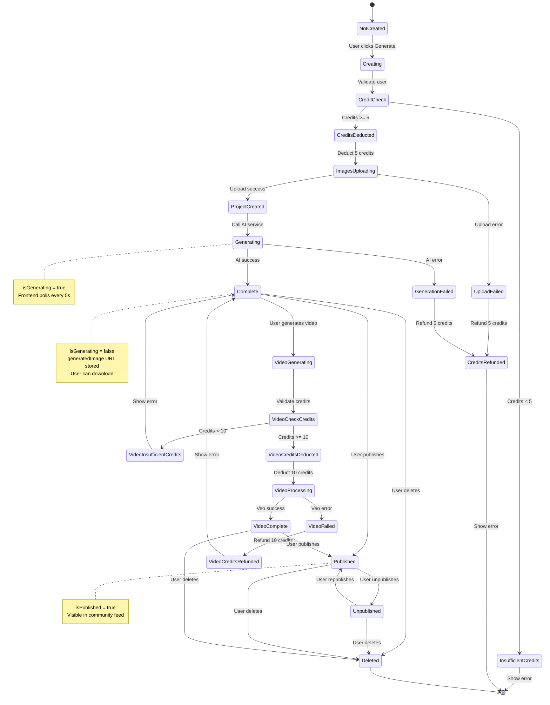
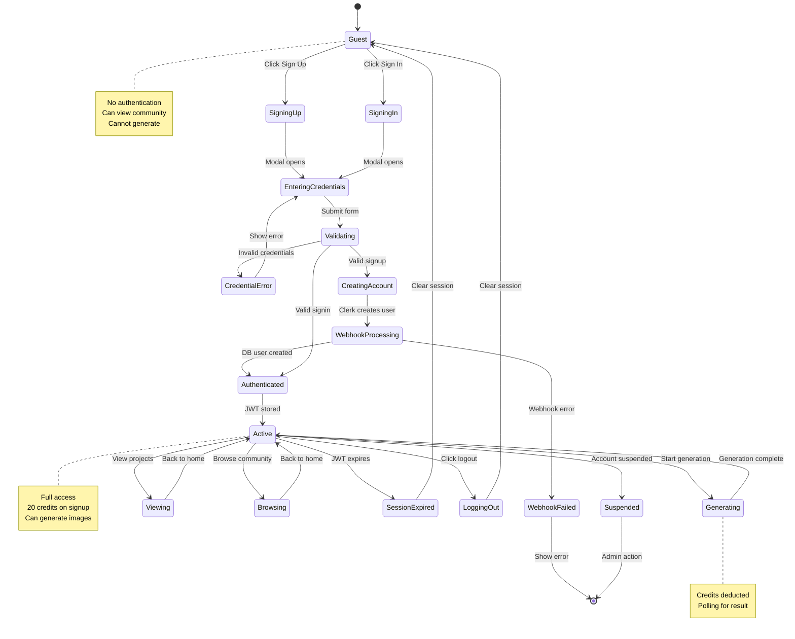
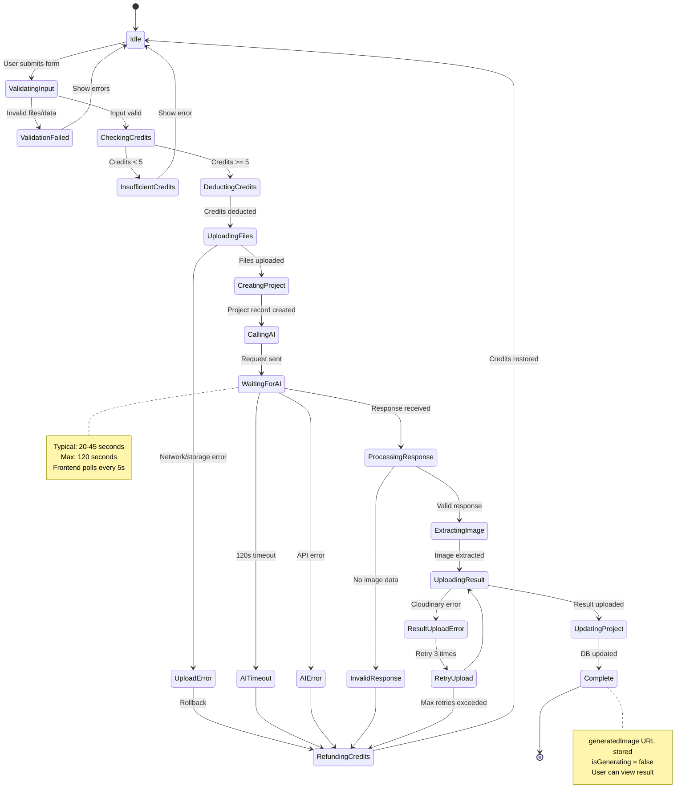
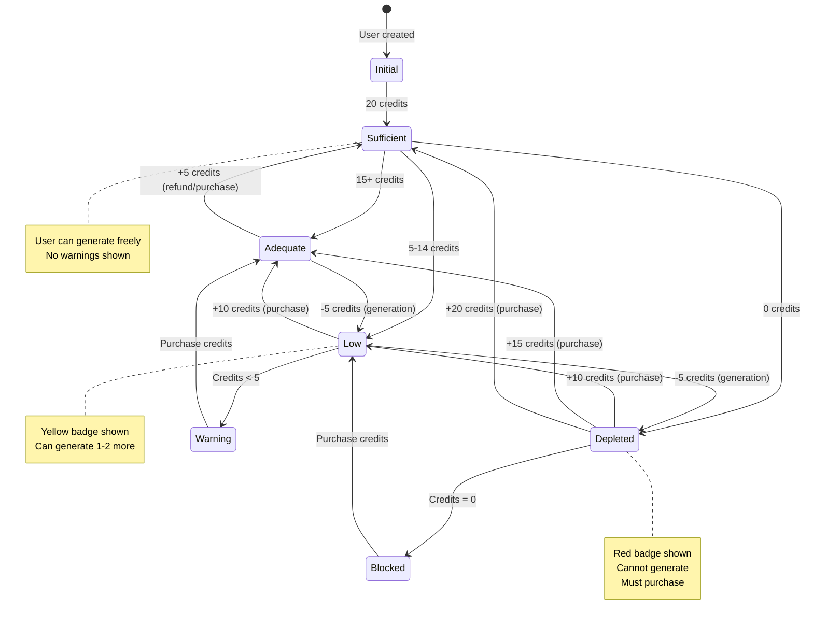
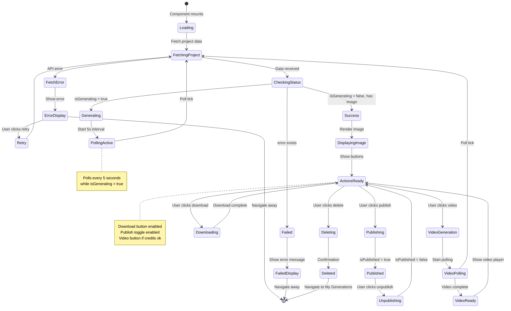
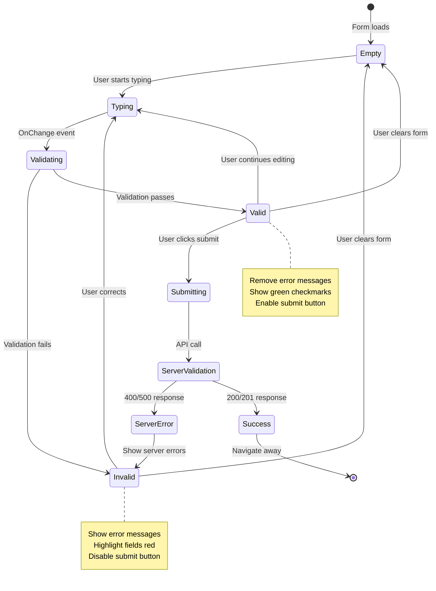

# State Chart Diagram

## UGC Image Generator - State Transitions

State chart diagrams show how objects transition between different states in response to events.

## 1. Project State Machine



### Project States Explained

| State | Description | Database Flags | User Actions Available |
|-------|-------------|----------------|------------------------|
| **Not Created** | Initial state before generation | N/A | Navigate to Generator |
| **Creating** | User initiating generation | N/A | Wait |
| **Credit Check** | Validating user credits | N/A | N/A |
| **Insufficient Credits** | User lacks credits | N/A | Purchase credits |
| **Credits Deducted** | Credits subtracted | credits -= 5 | N/A |
| **Images Uploading** | Uploading to Cloudinary | N/A | Wait |
| **Upload Failed** | Cloudinary error | N/A | Retry |
| **Project Created** | DB record created | isGenerating = true | Wait |
| **Generating** | AI processing images | isGenerating = true | Wait, Poll status |
| **Generation Failed** | AI error occurred | isGenerating = false, error set | View error, Retry |
| **Complete** | Image generated successfully | isGenerating = false, generatedImage set | Download, Publish, Video, Delete |
| **Published** | Visible in community | isPublished = true | Unpublish, Download, Delete |
| **Unpublished** | Removed from community | isPublished = false | Publish, Delete |
| **Video Generating** | Creating video from image | isGenerating = true | Wait |
| **Video Complete** | Video generated | generatedVideo set | Download video, Delete |
| **Deleted** | Project removed | Record deleted | N/A |

### State Transitions & Events

```
Event: CREATE_PROJECT
  Condition: User authenticated, form valid
  From: NotCreated → To: Creating

Event: CREDITS_VALIDATED
  Condition: Credits >= 5
  From: CreditCheck → To: CreditsDeducted
  Action: credits -= 5

Event: CREDITS_INSUFFICIENT
  Condition: Credits < 5
  From: CreditCheck → To: InsufficientCredits
  Action: Show error toast

Event: IMAGES_UPLOADED
  Condition: All files uploaded successfully
  From: ImagesUploading → To: ProjectCreated
  Action: Save Cloudinary URLs

Event: AI_GENERATION_START
  From: ProjectCreated → To: Generating
  Action: Call Gemini API, set isGenerating = true

Event: AI_GENERATION_SUCCESS
  Condition: Valid image returned
  From: Generating → To: Complete
  Action: Save generatedImage, set isGenerating = false

Event: AI_GENERATION_FAILED
  Condition: API error, timeout, invalid response
  From: Generating → To: GenerationFailed
  Action: Set error message, refund credits

Event: PUBLISH
  Condition: Image exists
  From: Complete/Unpublished → To: Published
  Action: Set isPublished = true

Event: UNPUBLISH
  From: Published → To: Unpublished
  Action: Set isPublished = false

Event: DELETE
  From: Any non-deleted state → To: Deleted
  Action: Delete DB record

Event: GENERATE_VIDEO
  Condition: Image exists, Credits >= 10
  From: Complete → To: VideoGenerating
  Action: credits -= 10, call Veo API
```

---

## 2. User State Machine



### User States Explained

| State | Description | Credits | Permissions |
|-------|-------------|---------|-------------|
| **Guest** | Unauthenticated visitor | 0 | View landing, community, pricing |
| **Signing Up** | Registration flow started | 0 | Fill registration form |
| **Signing In** | Login flow started | 0 | Fill login form |
| **Entering Credentials** | User typing credentials | 0 | Submit form |
| **Validating** | Clerk verifying credentials | 0 | Wait |
| **Creating Account** | Clerk creating user | 0 | Wait |
| **Webhook Processing** | Backend syncing user | 0 | Wait |
| **Authenticated** | JWT token received | 20 | All permissions |
| **Active** | Normal logged-in state | Variable | Full CRUD operations |
| **Generating** | Active generation in progress | Variable | Wait, view status |
| **Viewing** | Viewing own projects | Variable | Navigate, delete |
| **Browsing** | Viewing community | Variable | View, get inspired |
| **Session Expired** | JWT token expired | Variable | Re-authenticate |
| **Logging Out** | User initiated logout | Variable | Clearing session |
| **Suspended** | Account banned/suspended | Variable | Contact support |

---

## 3. Generation Process State Machine



### Generation States Timeline

```
0s: Idle
|
├─ 0-1s: ValidatingInput
├─ 1-2s: CheckingCredits
├─ 2-3s: DeductingCredits
├─ 3-5s: UploadingFiles
├─ 5-6s: CreatingProject
├─ 6-7s: CallingAI
|
├─ 7-52s: WaitingForAI (20-45s typical)
|     └─ Frontend polls every 5s
|     └─ Shows progress indicator
|
├─ 52-54s: ProcessingResponse
├─ 54-56s: ExtractingImage
├─ 56-58s: UploadingResult
├─ 58-59s: UpdatingProject
└─ 59s: Complete
```

---

## 4. Credit Balance State Machine



### Credit State Thresholds

| State | Range | UI Indicator | Actions Allowed |
|-------|-------|--------------|-----------------|
| **Initial** | 20 | Green badge | Generate (4x), Video (2x) |
| **Sufficient** | 20+ | Green | Generate multiple times |
| **Adequate** | 15-19 | Green | Generate 3+ times |
| **Low** | 5-14 | Yellow warning | Generate 1-2 times |
| **Warning** | 5-9 | Yellow + text | Generate once |
| **Depleted** | 0-4 | Red + text | Cannot generate |
| **Blocked** | 0 | Red banner | Must purchase |

### Credit Operations

```
Operation: IMAGE_GENERATION
  Cost: 5 credits
  Condition: credits >= 5
  On Success: Deduct 5
  On Failure: Refund 5

Operation: VIDEO_GENERATION
  Cost: 10 credits
  Condition: credits >= 10
  On Success: Deduct 10
  On Failure: Refund 10

Operation: PURCHASE (Future)
  Add: Variable (10, 25, 50, 100)
  Condition: Payment successful
  On Success: Add credits
  On Failure: No change
```

---

## 5. UI Component State Machine (Result Page)



---

## 6. Form Validation State Machine



---

## State Patterns Summary

### Common State Transitions

1. **Creation Flow**: Not Created → Creating → Processing → Complete
2. **Error Flow**: Any State → Error State → Recovery/End
3. **Polling Flow**: Initiated → Polling → Completed
4. **Toggle Flow**: State A ↔ State B (Publish/Unpublish)

### State Persistence

- **Database**: Project states (isGenerating, isPublished, error)
- **Client Session**: User authentication state (JWT token)
- **Local Storage**: UI preferences, form drafts (future)
- **Memory**: Component states (loading, error, data)

### Concurrent States

Some objects can be in multiple states simultaneously:
- Project can be: `Complete + Published + Downloaded`
- User can be: `Authenticated + Active + Generating`
- UI can be: `Loading + Polling + Displaying`

---

**Diagram Type**: State Chart Diagram  
**Notation**: UML State Machine (Mermaid)  
**Created**: February 18, 2026  
**Version**: 1.0.0
