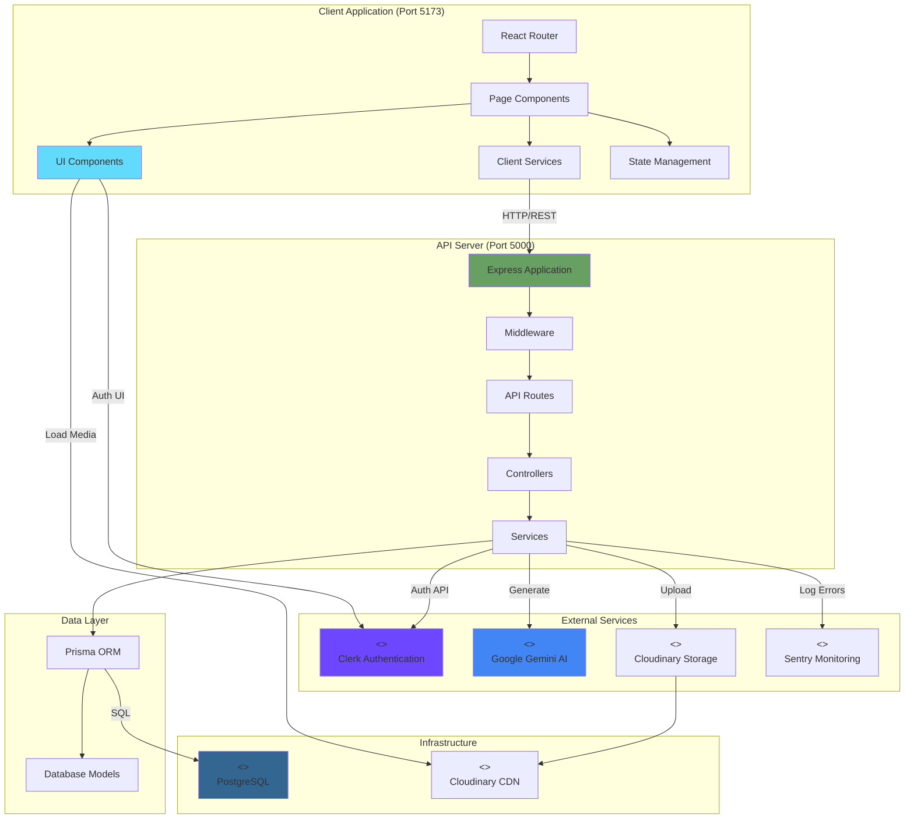
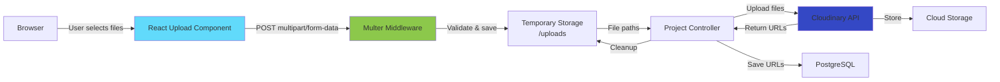

# Component Diagram

## UGC Image Generator - System Components

Component diagrams show the organization and dependencies between software components.

## 1. High-Level Component Architecture



---

## 2. Frontend Component Architecture

```mermaid
graph TB
    subgraph "Application Shell"
        App[App.tsx<br/>Main Component]
        Router[React Router DOM]
        Layout[Layout Components]
    end
    
    subgraph "Page Components"
        Home[Home.tsx]
        Generator[Generator.tsx]
        Result[Result.tsx]
        MyGenerations[MyGenerations.tsx]
        Community[Community.tsx]
        Plans[Plans.tsx]
    end
    
    subgraph "UI Components"
        Navbar[Navbar.tsx]
        Footer[Footer.tsx]
        Hero[Hero.tsx]
        Features[Features.tsx]
        Pricing[Pricing.tsx]
        FAQ[FAQ.tsx]
        ProjectCard[ProjectCard.tsx]
        UploadZone[UploadZone.tsx]
        Buttons[Buttons.tsx]
        Title[Title.tsx]
        CTA[CTA.tsx]
        SoftBackdrop[SoftBackdrop.tsx]
        Lenis[Lenis.tsx]
    end
    
    subgraph "Services & Configuration"
        AxiosConfig[axios.ts<br/>API Client]
        ClerkProvider[Clerk Provider]
        ToastProvider[Toast Provider]
    end
    
    subgraph "Utils & Types"
        Types[types/index.ts]
        Assets[assets/assets.tsx]
        DummyData[assets/dummy-data.tsx]
    end
    
    App --> Router
    App --> Layout
    Layout --> Navbar
    Layout --> Footer
    
    Router --> Home
    Router --> Generator
    Router --> Result
    Router --> MyGenerations
    Router --> Community
    Router --> Plans
    
    Home --> Hero
    Home --> Features
    Home --> Pricing
    Home --> FAQ
    
    Generator --> UploadZone
    Generator --> Buttons
    Result --> ProjectCard
    MyGenerations --> ProjectCard
    Community --> ProjectCard
    
    Generator --> AxiosConfig
    Result --> AxiosConfig
    MyGenerations --> AxiosConfig
    Community --> AxiosConfig
    
    App --> ClerkProvider
    App --> ToastProvider
    App --> SoftBackdrop
    App --> Lenis
    
    Generator --> Types
    Result --> Types
    MyGenerations --> Types
    
    style App fill:#61dafb
    style Router fill:#ca4245
    style AxiosConfig fill:#5a29e4
```



### Frontend Component Responsibilities

| Component | Type | Purpose | Dependencies |
|-----------|------|---------|--------------|
| **App.tsx** | Container | Root component, providers setup | Router, Clerk, Toast |
| **Router** | Infrastructure | Client-side routing | React Router DOM v7 |
| **Navbar** | UI | Navigation, user menu, credits display | Clerk, Lucide Icons |
| **Home** | Page | Landing page with marketing content | Hero, Features, Pricing, FAQ |
| **Generator** | Page | Image upload and generation form | UploadZone, Axios, Toast |
| **Result** | Page | Display generation result with polling | Axios, ProjectCard, Toast |
| **MyGenerations** | Page | User's project history grid | Axios, ProjectCard |
| **Community** | Page | Public feed of published projects | Axios, ProjectCard |
| **UploadZone** | UI | Drag & drop file upload | Lucide Icons |
| **ProjectCard** | UI | Project thumbnail with actions | Framer Motion |
| **AxiosConfig** | Service | HTTP client with interceptors | Axios, Clerk |

---

## 3. Backend Component Architecture

```mermaid
graph TB
    subgraph "Entry Point"
        Server[server.ts<br/>Express App]
    end
    
    subgraph "Middleware Layer"
        CORS[CORS Middleware]
        JSONParser[JSON Parser]
        ClerkMiddleware[Clerk Middleware]
        AuthMiddleware[Auth Middleware]
        FileUpload[Multer Middleware]
        ErrorHandler[Error Handler]
    end
    
    subgraph "Routing Layer"
        UserRoutes[User Routes<br/>/api/user/*]
        ProjectRoutes[Project Routes<br/>/api/project/*]
        WebhookRoute[Webhook Route<br/>/api/clerk]
    end
    
    subgraph "Controller Layer"
        UserController[User Controller]
        ProjectController[Project Controller]
        ClerkController[Clerk Webhook Controller]
    end
    
    subgraph "Service Layer"
        AIService[AI Service<br/>ai.ts]
        StorageService[Storage Config<br/>cloudinary]
        DatabaseService[Prisma Client<br/>prisma.ts]
        AuthService[Auth Logic]
    end
    
    subgraph "Configuration"
        PrismaConfig[prisma.ts]
        AIConfig[ai.ts]
        MulterConfig[multer.ts]
        InstrumentConfig[instrument.mjs<br/>Sentry]
    end
    
    subgraph "Database"
        PrismaClient[Prisma Client]
        Models[Generated Models]
    end
    
    Server --> CORS
    CORS --> JSONParser
    JSONParser --> ClerkMiddleware
    ClerkMiddleware --> UserRoutes
    ClerkMiddleware --> ProjectRoutes
    ClerkMiddleware --> WebhookRoute
    
    UserRoutes --> AuthMiddleware
    ProjectRoutes --> AuthMiddleware
    ProjectRoutes --> FileUpload
    
    AuthMiddleware --> UserController
    FileUpload --> ProjectController
    WebhookRoute --> ClerkController
    
    UserController --> DatabaseService
    ProjectController --> AIService
    ProjectController --> StorageService
    ProjectController --> DatabaseService
    ClerkController --> DatabaseService
    
    DatabaseService --> PrismaClient
    PrismaClient --> Models
    
    AIService --> AIConfig
    StorageService --> cloudinary
    DatabaseService --> PrismaConfig
    
    Server --> ErrorHandler
    Server --> InstrumentConfig
    
    style Server fill:#68a063
    style PrismaClient fill:#2d3748
    style AIService fill:#4285f4
```



### Backend Component Responsibilities

| Component | Type | Purpose | Dependencies |
|-----------|------|---------|--------------|
| **server.ts** | Entry | Initializes Express app, middleware, routes | Express, Clerk, Sentry |
| **CORS Middleware** | Middleware | Enables cross-origin requests | cors package |
| **Clerk Middleware** | Middleware | Attaches req.auth() method | @clerk/express |
| **Auth Middleware** | Middleware | Protects routes, validates JWT | Clerk |
| **Multer Middleware** | Middleware | Handles file uploads | multer package |
| **User Routes** | Router | Defines user/project query endpoints | Express Router |
| **Project Routes** | Router | Defines generation/CRUD endpoints | Express Router |
| **User Controller** | Controller | Handles user-related requests | Prisma |
| **Project Controller** | Controller | Orchestrates generation workflow | AI, Storage, Prisma |
| **AI Service** | Service | Wraps Google Gemini API | @google/genai |
| **Prisma Client** | ORM | Database abstraction layer | @prisma/client |
| **Error Handler** | Middleware | Catches and formats errors | Sentry |

---

## 4. Data Access Component Diagram

```mermaid
graph TB
    subgraph "Controllers"
        PC[Project Controller]
        UC[User Controller]
        CC[Clerk Controller]
    end
    
    subgraph "Prisma ORM"
        PrismaClient[Prisma Client]
        
        subgraph "Models"
            UserModel[User Model]
            ProjectModel[Project Model]
        end
        
        subgraph "Generated Code"
            Client[client.ts]
            Models[models.ts]
            Enums[enums.ts]
            InputTypes[commonInputTypes.ts]
        end
    end
    
    subgraph "Database"
        UserTable[User Table]
        ProjectTable[Project Table]
        Migrations[Migrations History]
    end
    
    PC --> PrismaClient
    UC --> PrismaClient
    CC --> PrismaClient
    
    PrismaClient --> UserModel
    PrismaClient --> ProjectModel
    
    UserModel --> Client
    ProjectModel --> Client
    
    UserModel -->|SQL Queries| UserTable
    ProjectModel -->|SQL Queries| ProjectTable
    
    Migrations -->|Defines Schema| UserTable
    Migrations -->|Defines Schema| ProjectTable
    
    style PrismaClient fill:#2d3748
    style UserTable fill:#336791
    style ProjectTable fill:#336791
```



### Database Component Details

```typescript
// Prisma Client Initialization
// File: server/configs/prisma.ts
import { PrismaClient } from "../generated/prisma/client.js";
import { PrismaPg } from "@prisma/adapter-pg";
import pg from "pg";

const pool = new pg.Pool({
  connectionString: process.env.DATABASE_URL
});

const adapter = new PrismaPg(pool);
export const prisma = new PrismaClient({ adapter });
```

**Component Flow:**
1. Controllers import `prisma` from config
2. Prisma Client uses generated models
3. Models map to database tables
4. Queries executed via PostgreSQL adapter
5. Results returned to controllers

---

## 5. External Service Integration Components

```mermaid
graph LR
    subgraph "Application"
        Backend[Backend Services]
        Frontend[Frontend App]
    end
    
    subgraph "Authentication"
        ClerkAPI[Clerk API]
        ClerkWidget[Clerk Widget]
        ClerkWebhook[Clerk Webhooks]
    end
    
    subgraph "AI Processing"
        GeminiAPI[Gemini 3 Pro API]
        VeoAPI[Veo 3.1 API]
    end
    
    subgraph "Storage"
        CloudinaryUpload[Cloudinary Upload API]
        CloudinaryCDN[Cloudinary CDN]
    end
    
    subgraph "Monitoring"
        SentrySDK[Sentry SDK]
        SentryDashboard[Sentry Dashboard]
    end
    
    Frontend -->|Auth UI| ClerkWidget
    Frontend -->|Fetch Media| CloudinaryCDN
    
    Backend -->|Verify Token| ClerkAPI
    Backend -->|Generate Image| GeminiAPI
    Backend -->|Generate Video| VeoAPI
    Backend -->|Upload Files| CloudinaryUpload
    Backend -->|Log Errors| SentrySDK
    
    ClerkAPI -->|Events| ClerkWebhook
    ClerkWebhook -->|User Sync| Backend
    
    CloudinaryUpload -->|Stores| CloudinaryCDN
    SentrySDK -->|Sends| SentryDashboard
    
    style Backend fill:#68a063
    style Frontend fill:#61dafb
    style ClerkAPI fill:#6c47ff
    style GeminiAPI fill:#4285f4
    style CloudinaryUpload fill:#3448c5
    style SentrySDK fill:#362d59
```



### External Service Components

| Service | Component Type | Purpose | Protocol |
|---------|----------------|---------|----------|
| **Clerk API** | Authentication | Token verification, user management | REST API |
| **Clerk Widget** | UI Component | Sign up/sign in modal | React Component |
| **Clerk Webhooks** | Event Handler | User sync to database | HTTP POST |
| **Gemini API** | AI Service | Image generation from 2 inputs | REST API |
| **Veo API** | AI Service | Video generation from prompt | REST API |
| **Cloudinary Upload** | Storage API | File upload endpoint | REST API |
| **Cloudinary CDN** | Content Delivery | Serve images/videos globally | CDN |
| **Sentry SDK** | Monitoring | Error tracking and logging | SDK |

---

## 6. Deployment Component Diagram

```mermaid
graph TB
    subgraph "Client Deployment"
        Vercel[Vercel Platform]
        ClientBuild[Built React App<br/>Static Files]
        CDNEdge[Edge Network]
    end
    
    subgraph "Server Deployment"
        Railway[Railway Platform]
        ServerBuild[Node.js Server<br/>Express App]
        ServerEnv[Environment Variables]
    end
    
    subgraph "Database"
        Neon[Neon PostgreSQL<br/>Serverless]
        NeonReplicas[Read Replicas]
    end
    
    subgraph "External Services"
        ClerkCloud[Clerk Cloud]
        GoogleCloud[Google Cloud AI]
        CloudinaryCloud[Cloudinary]
        SentryCloud[Sentry Cloud]
    end
    
    subgraph "Users"
        Browser[User Browser]
    end
    
    ClientBuild --> Vercel
    Vercel --> CDNEdge
    Browser --> CDNEdge
    
    ServerBuild --> Railway
    ServerEnv --> Railway
    Browser --> Railway
    
    Railway --> Neon
    Neon --> NeonReplicas
    
    Railway --> ClerkCloud
    Railway --> GoogleCloud
    Railway --> CloudinaryCloud
    Railway --> SentryCloud
    
    CDNEdge --> Railway
    
    style Vercel fill:#000
    style Railway fill:#7733ff
    style Neon fill:#00e699
    style ClerkCloud fill:#6c47ff
    style GoogleCloud fill:#4285f4
```



---

## 7. File Upload Component Flow



**Flow Steps:**
1. User drags/selects images in browser
2. React component validates file types and sizes
3. FormData object created with files
4. POST request sent to backend
5. Multer intercepts and validates files
6. Files temporarily saved to `/uploads` directory
7. Controller receives file paths
8. Controller uploads each file to Cloudinary
9. Cloudinary returns secure URLs
10. Controller saves URLs to database
11. Controller deletes temporary files
12. Response sent with project ID

---

## 8. Component Dependencies Matrix

### Frontend Dependencies

| Component | Depends On | Provides To |
|-----------|------------|-------------|
| **App** | Router, Clerk, Toast | All pages |
| **Router** | React Router DOM | App |
| **Generator** | Axios, UploadZone, Toast | - |
| **Result** | Axios, Toast, ProjectCard | - |
| **Axios** | Clerk session | All pages |
| **UploadZone** | - | Generator |
| **ProjectCard** | Framer Motion | Result, MyGenerations, Community |

### Backend Dependencies

| Component | Depends On | Provides To |
|-----------|------------|-------------|
| **server.ts** | Express, Clerk, Sentry | - |
| **Routes** | Controllers | Express app |
| **Controllers** | Services, Prisma | Routes |
| **AI Service** | Google GenAI SDK | Controllers |
| **Prisma** | PostgreSQL, Models | Controllers |
| **Multer** | Express | Routes |

---

## Component Patterns

### 1. **Layered Architecture**
```
Presentation (UI) → Business Logic (Controllers) → Data Access (Prisma) → Database
```

### 2. **Service Layer Pattern**
```
Controllers → Services (AI, Storage, Auth) → External APIs
```

### 3. **Dependency Injection**
```
Configuration → Service Instances → Controllers
```

### 4. **Adapter Pattern**
```
Prisma Adapter → PostgreSQL Driver → Database
```

### 5. **Middleware Pipeline**
```
Request → CORS → JSON → Clerk → Auth → Route → Controller → Response
```

---

## Component Interfaces

### API Contracts (REST)

**Frontend ↔ Backend**
```typescript
interface ProjectCreateRequest {
  images: File[];
  name: string;
  productName: string;
  productDescription?: string;
  userPrompt?: string;
  aspectRatio: "9:16" | "16:9";
}

interface ProjectCreateResponse {
  projectId: string;
  message: string;
}
```

**Backend ↔ Google AI**
```typescript
interface GenerateContentRequest {
  model: string;
  contents: Array<InlineData | TextPrompt>;
  config: GenerationConfig;
}

interface GenerateContentResponse {
  candidates: Array<{
    content: { parts: Array<{ inlineData: { data: string } }> }
  }>;
}
```

**Backend ↔ Cloudinary**
```typescript
interface UploadRequest {
  file: string | Buffer;
  options: { resource_type: "image" | "video" };
}

interface UploadResponse {
  secure_url: string;
  public_id: string;
}
```

---

**Diagram Type**: Component Diagram  
**Notation**: UML Component (Mermaid Graph)  
**Created**: February 18, 2026  
**Version**: 1.0.0
