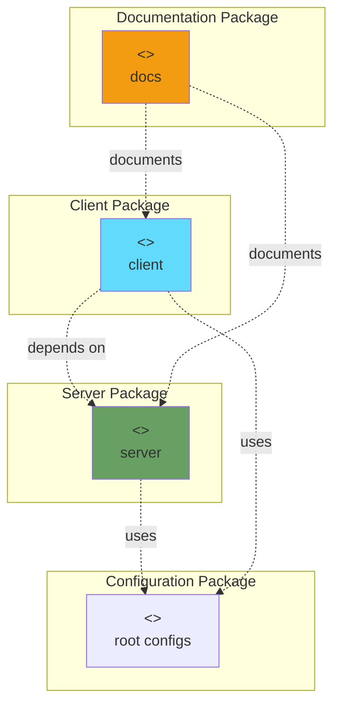
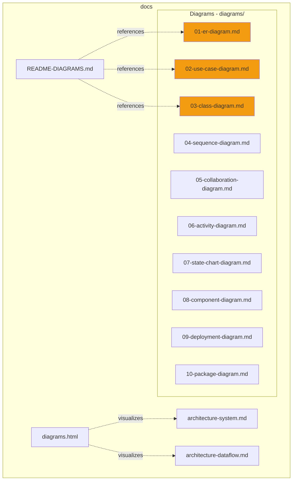
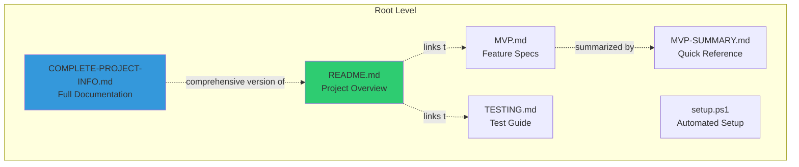

# Package Diagram

## UGC Image Generator - Software Package Organization

Package diagrams show how the system is organized into packages and the dependencies between them.

## 1. High-Level Package Structure



---

## 2. Client Package Structure

```mermaid
graph TB
    subgraph "client"
        subgraph "Source Code - src/"
            Pages[pages/<br/>Route Components]
            Components[components/<br/>UI Components]
            Configs[configs/<br/>API Config]
            Types[types/<br/>TypeScript Definitions]
            Assets[assets/<br/>Static Resources]
            
            Pages --> Components
            Pages --> Configs
            Pages --> Types
            Components --> Types
            Configs --> Types
        end
        
        subgraph "Build Configuration"
            Vite[vite.config.ts]
            TSConfig[tsconfig.json]
            ESLint[eslint.config.js]
        end
        
        subgraph "Entry Points"
            Index[index.html]
            Main[main.tsx]
            App[App.tsx]
            
            Index --> Main
            Main --> App
            App --> Pages
        end
        
        subgraph "Public Assets"
            Public[public/<br/>Static Files]
        end
        
        subgraph "Dependencies"
            React[react@19.0.0]
            ReactRouter[react-router-dom@7.1.1]
            Clerk[clerk/clerk-react@6.11.0]
            Axios[axios@1.7.9]
            Tailwind[tailwindcss@4.1.5]
            Framer[framer-motion@12.0.3]
            
            App --> React
            Pages --> ReactRouter
            Pages --> Clerk
            Configs --> Axios
            Components --> Framer
        end
        
        Vite --> TSConfig
        Vite --> ESLint
    end
    
    style Pages fill:#61dafb
    style Components fill:#61dafb
    style Configs fill:#5a29e4
    style Types fill:#3178c6
```

### Client Package Details

| Package | Purpose | Key Files | Dependencies |
|---------|---------|-----------|--------------|
| **src/pages/** | Route-level components | Home, Generator, Result, MyGenerations, Community, Plans | React, Router, Axios |
| **src/components/** | Reusable UI components | Navbar, Footer, Hero, Features, Pricing, FAQ, ProjectCard, UploadZone, Buttons | React, Framer Motion |
| **src/configs/** | Configuration modules | axios.ts (API client setup) | Axios, Clerk |
| **src/types/** | TypeScript type definitions | index.ts (Project, User, etc.) | None |
| **src/assets/** | Static resources | assets.tsx, dummy-data.tsx, schema.prisma | None |
| **public/** | Static public files | Favicon, manifest | None |

---

## 3. Server Package Structure

```mermaid
graph TB
    subgraph "server"
        subgraph "Entry Point"
            Server[server.ts<br/>Express App]
        end
        
        subgraph "Routes Layer - routes/"
            UserRoutes[userRoutes.ts]
            ProjectRoutes[projectRoutes.ts]
            
            Server --> UserRoutes
            Server --> ProjectRoutes
        end
        
        subgraph "Controllers Layer - controllers/"
            UserController[userController.ts]
            ProjectController[projectController.ts]
            ClerkController[clerk.ts]
            
            UserRoutes --> UserController
            ProjectRoutes --> ProjectController
            Server --> ClerkController
        end
        
        subgraph "Middleware Layer - middlewares/"
            Auth[auth.ts<br/>JWT Verification]
            
            UserRoutes -.uses.-> Auth
            ProjectRoutes -.uses.-> Auth
        end
        
        subgraph "Configuration - configs/"
            Prisma[prisma.ts<br/>DB Client]
            AI[ai.ts<br/>Gemini Config]
            Multer[multer.ts<br/>File Upload]
            Instrument[instrument.mjs<br/>Sentry]
            
            Server --> Instrument
            Server --> Multer
            UserController --> Prisma
            ProjectController --> Prisma
            ProjectController --> AI
        end
        
        subgraph "Generated Code - generated/prisma/"
            Client[client.ts]
            Models[models.ts]
            Enums[enums.ts]
            InputTypes[commonInputTypes.ts]
            
            Prisma --> Client
            Client --> Models
        end
        
        subgraph "Database Schema - prisma/"
            Schema[schema.prisma]
            Migrations[migrations/]
            
            Schema -.generates.-> Client
            Schema --> Migrations
        end
        
        subgraph "Type Definitions - types/"
            ExpressTypes[express.d.ts<br/>Custom Types]
            
            Auth --> ExpressTypes
        end
        
        subgraph "Temporary Storage"
            Videos[videos/<br/>Temp Files]
            
            Multer --> Videos
        end
    end
    
    style Server fill:#68a063
    style UserController fill:#68a063
    style ProjectController fill:#68a063
    style Prisma fill:#2d3748
    style AI fill:#4285f4
```



### Server Package Details

| Package | Purpose | Key Files | Dependencies |
|---------|---------|-----------|--------------|
| **routes/** | API endpoint definitions | userRoutes.ts, projectRoutes.ts | Express, Controllers |
| **controllers/** | Business logic handlers | userController.ts, projectController.ts, clerk.ts | Prisma, AI, Cloudinary |
| **middlewares/** | Request interceptors | auth.ts | Clerk/Express |
| **configs/** | Service configurations | prisma.ts, ai.ts, multer.ts, instrument.mjs | Prisma, Google AI, Multer, Sentry |
| **generated/prisma/** | Auto-generated ORM code | client.ts, models.ts, enums.ts | Prisma |
| **prisma/** | Database schema & migrations | schema.prisma, migrations/ | Prisma |
| **types/** | TypeScript augmentations | express.d.ts | None |
| **videos/** | Temporary file storage | (empty, runtime usage) | None |

---

## 4. Documentation Package Structure



---

## 5. Root Configuration Package



---

## 6. Dependency Graph - Client

```mermaid
graph LR
    subgraph "Core Dependencies"
        React[react@19.0.0]
        ReactDOM[react-dom@19.0.0]
    end
    
    subgraph "Routing"
        ReactRouter[react-router-dom@7.1.1]
    end
    
    subgraph "State & Data"
        Axios[axios@1.7.9]
    end
    
    subgraph "Authentication"
        Clerk[clerk/clerk-react@6.11.0]
    end
    
    subgraph "UI & Styling"
        Tailwind[tailwindcss@4.1.5]
        Framer[framer-motion@12.0.3]
    end
    
    subgraph "Utilities"
        Lucide[lucide-react@0.469.0]
        Sonner[sonner@1.7.3]
    end
    
    subgraph "Build Tools"
        Vite[vite@6.0.7]
        TypeScript[typescript@5.7.3]
        ESLint[eslint@9.18.0]
    end
    
    ReactDOM --> React
    ReactRouter --> React
    Clerk --> React
    Framer --> React
    
    Vite --> React
    Vite --> TypeScript
    
    style React fill:#61dafb
    style Vite fill:#646cff
    style TypeScript fill:#3178c6
```

### Client Dependencies (package.json)

```json
{
  "dependencies": {
    "@clerk/clerk-react": "^6.11.0",
    "@radix-ui/react-accordion": "^1.2.3",
    "axios": "^1.7.9",
    "framer-motion": "^12.0.3",
    "lucide-react": "^0.469.0",
    "react": "^19.0.0",
    "react-dom": "^19.0.0",
    "react-router-dom": "^7.1.1",
    "sonner": "^1.7.3",
    "tailwindcss": "^4.1.5"
  },
  "devDependencies": {
    "@eslint/js": "^9.18.0",
    "@types/react": "^19.0.6",
    "@types/react-dom": "^19.0.2",
    "@vitejs/plugin-react-swc": "^3.8.0",
    "eslint": "^9.18.0",
    "typescript": "~5.7.3",
    "typescript-eslint": "^8.20.0",
    "vite": "^6.0.7"
  }
}
```

---

## 7. Dependency Graph - Server

```mermaid
graph LR
    subgraph "Core Framework"
        Express[express@5.0.1]
        Node[Node.js 22]
    end
    
    subgraph "Database"
        Prisma[prisma/client@7.3.0]
        PrismaAdapter[prisma/adapter-pg@7.3.0]
        PG[pg@8.13.1]
    end
    
    subgraph "Authentication"
        ClerkSDK[clerk/express@2.4.1]
        SVIX[svix@1.42.0]
    end
    
    subgraph "File Handling"
        Multer[multer@1.4.5-lts.1]
        Cloudinary[cloudinary@2.6.1]
    end
    
    subgraph "AI Services"
        GoogleGenAI[google/generative-ai@0.24.0]
    end
    
    subgraph "Utilities"
        CORS[cors@2.8.5]
        Dotenv[dotenv@16.4.7]
    end
    
    subgraph "Monitoring"
        Sentry[sentry/node@8.48.0]
        SentryProfiling[sentry/profiling-node@8.48.0]
    end
    
    subgraph "Build Tools"
        TypeScript[typescript@5.7.3]
        TSXNode[tsx@4.19.2]
    end
    
    Express --> Node
    Prisma --> PG
    PrismaAdapter --> Prisma
    PrismaAdapter --> PG
    ClerkSDK --> Express
    Multer --> Express
    CORS --> Express
    
    style Express fill:#68a063
    style Prisma fill:#2d3748
    style ClerkSDK fill:#6c47ff
    style GoogleGenAI fill:#4285f4
```

### Server Dependencies (package.json)

```json
{
  "dependencies": {
    "@clerk/express": "^2.4.1",
    "@google/generative-ai": "^0.24.0",
    "@prisma/adapter-pg": "^7.3.0",
    "@prisma/client": "^7.3.0",
    "@sentry/node": "^8.48.0",
    "@sentry/profiling-node": "^8.48.0",
    "cloudinary": "^2.6.1",
    "cors": "^2.8.5",
    "dotenv": "^16.4.7",
    "express": "^5.0.1",
    "multer": "1.4.5-lts.1",
    "pg": "^8.13.1",
    "svix": "^1.42.0"
  },
  "devDependencies": {
    "@types/cors": "^2.8.17",
    "@types/express": "^5.0.0",
    "@types/multer": "^1.4.12",
    "@types/pg": "^8.11.10",
    "prisma": "^7.3.0",
    "tsx": "^4.19.2",
    "typescript": "^5.7.3"
  }
}
```

---

## 8. Package Import Relationships

### Client Import Flow

```
main.tsx
  └─> App.tsx
       ├─> configs/axios.ts
       ├─> @clerk/clerk-react
       ├─> sonner (Toast)
       └─> pages/
            ├─> Home.tsx
            │    └─> components/
            │         ├─> Navbar.tsx
            │         ├─> Hero.tsx
            │         ├─> Features.tsx
            │         ├─> Pricing.tsx
            │         └─> FAQ.tsx
            ├─> Generator.tsx
            │    ├─> components/UploadZone.tsx
            │    ├─> configs/axios.ts
            │    └─> types/index.ts
            ├─> Result.tsx
            │    ├─> components/ProjectCard.tsx
            │    ├─> configs/axios.ts
            │    └─> types/index.ts
            ├─> MyGenerations.tsx
            │    ├─> components/ProjectCard.tsx
            │    └─> configs/axios.ts
            └─> Community.tsx
                 ├─> components/ProjectCard.tsx
                 └─> configs/axios.ts
```

### Server Import Flow

```
server.ts
  ├─> configs/instrument.mjs (Sentry)
  ├─> configs/prisma.ts
  │    └─> generated/prisma/client.ts
  ├─> @clerk/express
  ├─> middlewares/auth.ts
  │    └─> @clerk/express
  ├─> routes/userRoutes.ts
  │    └─> controllers/userController.ts
  │         └─> configs/prisma.ts
  ├─> routes/projectRoutes.ts
  │    ├─> configs/multer.ts
  │    └─> controllers/projectController.ts
  │         ├─> configs/prisma.ts
  │         ├─> configs/ai.ts
  │         │    └─> @google/generative-ai
  │         └─> cloudinary
  └─> controllers/clerk.ts
       └─> configs/prisma.ts
```

---

## 9. Package Versioning & Compatibility

### Compatibility Matrix

| Package | Version | Compatible With | Breaking Changes |
|---------|---------|-----------------|------------------|
| **Node.js** | 22.x LTS | All dependencies | None (LTS) |
| **React** | 19.0.0 | React Router 7, Clerk 6 | Removed legacy APIs |
| **React Router** | 7.1.1 | React 19 | New routing API |
| **Express** | 5.0.1 | Node 18+ | Async error handling |
| **Prisma** | 7.3.0 | PostgreSQL 16 | New client API |
| **TypeScript** | 5.7.3 | All TS dependencies | None |
| **Vite** | 6.0.7 | React 19 | Updated plugin API |

---

## 10. Package Deployment Artifacts

### Build Outputs

```mermaid
graph TB
    subgraph "Source Code"
        ClientSrc[client/src/]
        ServerSrc[server/]
    end
    
    subgraph "Build Process"
        ViteBuild[Vite Build]
        TSCBuild[TypeScript Compiler]
    end
    
    subgraph "Artifacts"
        ClientDist[client/dist/<br/>Static HTML/JS/CSS]
        ServerDist[server/dist/<br/>Compiled JS]
        PrismaGenerated[server/generated/<br/>Prisma Client]
    end
    
    subgraph "Deployment Targets"
        VercelCDN[Vercel CDN]
        RailwayDocker[Railway Container]
    end
    
    ClientSrc --> ViteBuild
    ViteBuild --> ClientDist
    ClientDist --> VercelCDN
    
    ServerSrc --> TSCBuild
    TSCBuild --> ServerDist
    ServerDist --> RailwayDocker
    
    PrismaGenerated --> RailwayDocker
    
    style ClientDist fill:#61dafb
    style ServerDist fill:#68a063
    style PrismaGenerated fill:#2d3748
```



### Artifact Details

| Artifact | Size (Approx) | Contents | Target Environment |
|----------|---------------|----------|-------------------|
| **client/dist/** | ~500 KB (gzipped) | index.html, JS bundles, CSS, assets | Vercel CDN |
| **server/dist/** | ~200 KB | Compiled .js files | Railway Docker |
| **server/generated/** | ~500 KB | Prisma client code | Railway Docker |
| **server/node_modules/** | ~150 MB | Runtime dependencies | Railway Docker |
| **client/node_modules/** | ~300 MB | Build-time only (not deployed) | Local dev |

---

## Package Organization Best Practices

### 1. **Separation of Concerns**
- **Client**: UI rendering, user interaction, API calls
- **Server**: Business logic, data access, external service integration
- **Docs**: Human-readable documentation, diagrams

### 2. **Dependency Management**
- Use exact versions for production dependencies
- Lock file committed to version control (package-lock.json)
- Regular security audits (`npm audit`)

### 3. **Code Organization**
- Flat structure for small projects (current state)
- Layered architecture (routes → controllers → services)
- Generated code isolated in `generated/` folder

### 4. **Build Optimization**
- Tree-shaking enabled (Vite/ESBuild)
- Code splitting by route (React Router lazy loading)
- Environment-specific builds (dev vs prod)

---

## Package Diagram Summary

### Total Packages: 4

1. **client** (Frontend Application)
   - 5 subpackages: pages, components, configs, types, assets
   - 11 production dependencies
   - 7 dev dependencies

2. **server** (Backend Application)
   - 7 subpackages: routes, controllers, middlewares, configs, generated, prisma, types
   - 12 production dependencies
   - 5 dev dependencies

3. **docs** (Documentation)
   - 2 subpackages: diagrams, architecture
   - 14 diagram files

4. **root** (Project Configuration)
   - 6 documentation files
   - 1 setup script

---

**Diagram Type**: Package Diagram  
**Notation**: UML Package (Mermaid Graph)  
**Created**: February 18, 2026  
**Version**: 1.0.0
